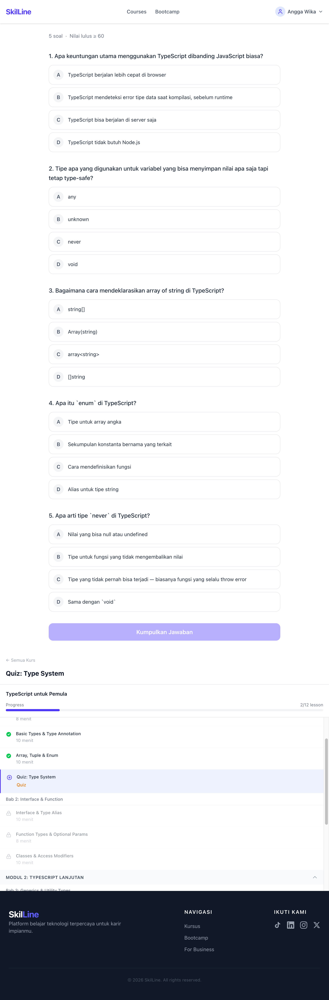
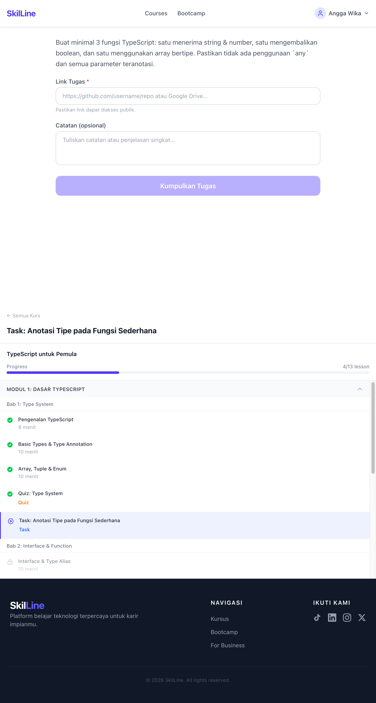
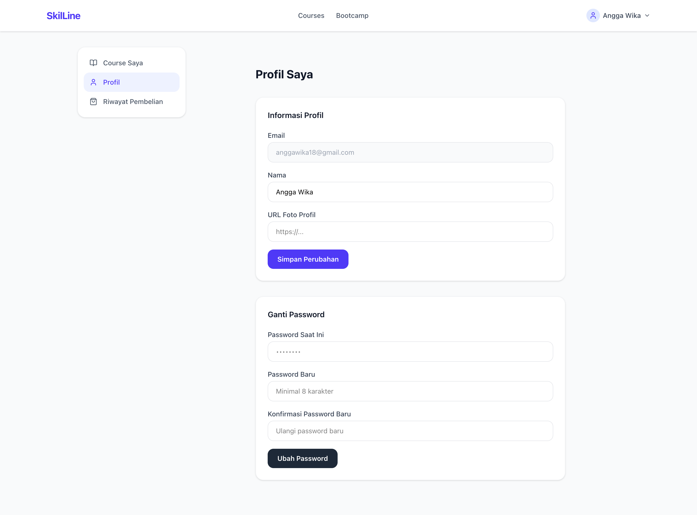

# Fullstack MEVN - Learning Management System

Learning Management System (LMS) fullstack yang dibangun dengan stack **MEVN** — MongoDB, Express, Vue.js, Node.js.

> 🇬🇧 Versi bahasa Inggris: [README.MD](README.MD)
>
> Istilah teknis (nama berkas, nama fungsi, endpoint, nama field) sengaja dibiarkan
> dalam bahasa aslinya agar tetap cocok dengan kode. Label antarmuka yang memang
> berbahasa Indonesia di aplikasi juga ditulis apa adanya.

## Struktur Proyek

```
fullstack-mevn-lsm/
├── fe-apps/      # Frontend - Vue 3 + TypeScript + Vite
└── be-server/    # Backend  - Node.js + Express + MongoDB + Mongoose
```

---

## Struktur Folder

### Frontend (`fe-apps/src/`)

```
src/
├── api/
│   ├── client.ts              # Instance Axios + interceptor (silent refresh)
│   ├── auth.ts                # Semua pemanggilan API auth
│   ├── courses.ts             # Pemanggilan API course + lesson + progress
│   ├── bootcamps.ts           # Pemanggilan API bootcamp
│   ├── quiz.ts                # Pemanggilan API quiz
│   ├── tasks.ts               # Pemanggilan API task
│   ├── checkout.ts            # Pemanggilan API checkout + verifikasi pembayaran
│   ├── enrollments.ts         # Pemanggilan API cek enrollment + my-courses
│   ├── users.ts               # Pemanggilan API profil user + ganti kata sandi
│   ├── orders.ts              # Pemanggilan API riwayat pembelian
│   └── admin/
│       ├── courses.ts         # CRUD admin course + module + chapter + lesson (interface TypeScript + pemanggilan API)
│       ├── quiz.ts            # CRUD quiz admin + interface AdminQuizQuestion
│       ├── bootcamps.ts       # CRUD bootcamp admin; MentorUser / AdminMentor / AdminMentorPayload / AdminBootcampParticipant + adminListMentors() / adminListBootcampParticipants()
│       ├── topics.ts          # CRUD topic admin; interface AdminTopic + adminListTopics/adminCreateTopic/adminUpdateTopic/adminDeleteTopic
│       ├── users.ts           # User admin; interface AdminUser/AdminUserDetail/AdminUserEnrollment/AdminUserOrder + adminListUsers/adminGetUser/adminUpdateUserRole
│       ├── tasks.ts           # Review task admin; interface AdminTaskSubmission/AdminTaskSubmissionDetail/AdminTaskHistoryItem + adminListSubmissions/adminGetSubmission/adminReviewSubmission
│       └── dashboard.ts       # Dashboard admin; interface AdminDashboardStats / AdminRevenueReport / RevenuePoint / RevenueTopCourse + adminGetDashboardStats/adminGetRevenueReport
├── composables/
│   ├── useDeviceId.ts         # Membuat dan membaca UUID deviceId
│   ├── auth/                  # Composable auth (logika dipisah dari view)
│   │   ├── useLogin.ts
│   │   ├── useRegister.ts
│   │   ├── useOtpVerification.ts
│   │   ├── useForgotPassword.ts
│   │   ├── useResetPassword.ts
│   │   └── useGoogleAuth.ts
│   ├── courses/               # Composable course
│   │   ├── useCourses.ts      # useQuery untuk daftar course + filter topic
│   │   ├── useCourseDetail.ts # useQuery untuk detail course + daftar lesson + computed course/isEnrolled/isCompleted
│   │   ├── useProgress.ts     # useMutation untuk menandai lesson selesai
│   │   ├── useQuiz.ts         # Soal quiz, attempt, mutation submit
│   │   ├── useTask.ts         # Query submission task + mutation submit
│   │   └── useCertificate.ts  # Query sertifikat + unduh PDF (html2canvas + jsPDF, impor dinamis)
│   ├── bootcamps/
│   │   ├── useBootcamps.ts
│   │   ├── useBootcampDetail.ts
│   │   ├── useBootcampCheckout.ts # load snap.js, createOrder per batch, callback snap.pay
│   │   ├── useBootcampEnrollment.ts # polling enrollment batch + timeout + manualVerify
│   │   ├── useMyBootcamps.ts    # query bootcamp yang diikuti + pisah aktif/selesai + helper badge status & tanggal + liveSessionOf()
│   │   └── useLiveSession.ts    # join/leave kanal Agora, track lokal & jarak jauh, toggle mic/kamera
│   ├── checkout/
│   │   ├── useCheckout.ts     # memuat snap.js, createOrder, callback snap.pay
│   │   └── useEnrollment.ts   # polling + timeout + fallback manualVerify
│   ├── enrollments/
│   │   └── useMyEnrollments.ts  # useQuery untuk my-courses beserta progress
│   ├── orders/
│   │   └── useOrders.ts         # useQuery untuk riwayat pembelian
│   ├── user/
│   │   └── useProfile.ts        # query getProfile + mutation updateProfile & changePassword
│   └── admin/                   # Composable admin (satu berkas per urusan)
│       ├── useCourseList.ts     # query daftar course + togglePublish + confirmDelete
│       ├── useCourseForm.ts     # mutation form create/edit course
│       ├── useCourseContent.ts  # query detail course + helper invalidate
│       ├── useCourseEditor.ts   # state expand + semua mutation CRUD module/chapter/lesson + expandedQuizzes/toggleQuiz
│       ├── useAdminMenu.ts     # adminMenuItems + isAdminMenuActive — sumber tunggal menu admin (sidebar AdminLayout & dropdown navbar)
│       ├── useQuizEditor.ts     # mutation CRUD soal quiz per lesson (tambah / ubah / hapus + state showAddForm)
│       ├── useBootcampList.ts   # query daftar bootcamp + confirmDelete
│       ├── useBootcampForm.ts   # create/edit package + pemilih mentor (toggleMentor / isMentorSelected / updateOccupation)
│       ├── useBootcampContent.ts # query detail package + helper invalidate
│       ├── useBootcampParticipants.ts # query peserta package + hitung per batch + filter batch + helper badge/tanggal
│       ├── useBootcampEditor.ts  # expandedBatches + toggleBatch + expandAll/collapseAll + mutation CRUD batch & session
│       ├── useTopicList.ts      # query daftar topic + mutation tambah/ubah/hapus + state showAddForm/editingTopic
│       ├── useUserList.ts       # query daftar user (pencarian + paginasi) + mutation changeRole
│       ├── useUserDetail.ts     # query detail user + mutation changeRole + helper roleBadge/roleOptions/formatDate/formatRupiah/statusBadge
│       ├── useTaskReview.ts     # query daftar submission task (filter status + paginasi) + mutation approve cepat + helper tampilan bersama (taskStatusBadge/taskStatusLabel/taskFilterOptions/formatTaskDate/formatTaskDateTime/userInitials)
│       ├── useTaskReviewDetail.ts # query detail satu submission (soal + jawaban + riwayat) + mutation approve/reject dengan feedback
│       ├── useDashboardStats.ts  # query statistik dashboard (jumlah + pendapatan + transaksi terbaru)
│       └── useRevenueReport.ts   # query pendapatan berdasarkan tahun + dua set batang bulanan (courseBars & bootcampBars, 12 bulan diisi nol, skala dibagi) + state pemilih tahun
├── layouts/
│   ├── DefaultLayout.vue      # Navbar + Footer
│   ├── AuthLayout.vue         # Layar terbagi (branding kiri, form kanan)
│   ├── ProfileLayout.vue      # Navbar + sidebar (Course Saya, Profil, Riwayat Pembelian) + RouterView
│   └── AdminLayout.vue        # Navbar + sidebar admin (menu dibaca dari useAdminMenu) + RouterView
├── router/
│   ├── index.ts               # Vue Router + navigation guard (requiresAuth + requiresAdmin)
│   └── routes/
│       ├── auth.ts            # Route auth (khusus tamu)
│       ├── public.ts          # Route publik di bawah DefaultLayout
│       ├── protected.ts       # Route terproteksi di bawah ProfileLayout (requiresAuth)
│       └── admin.ts           # Route admin di bawah AdminLayout (requiresAdmin)
├── stores/
│   ├── authStore.ts           # Pinia — access token (memori), user, refresh token (localStorage)
│   └── errorStore.ts          # Pinia — state modal kesalahan menyeluruh
├── types/
│   ├── api.ts                 # ApiResponse<T> + Pagination bersama
│   ├── auth.ts                # Permintaan/balasan auth + UpdateProfilePayload + ChangePasswordPayload
│   ├── courses.ts             # Course, Lesson, Module, Chapter, CourseDetail, Progress
│   ├── bootcamps.ts           # Tipe bootcamp
│   ├── checkout.ts            # Order, CreateOrderResponse, EnrollmentStatus, VerifyPaymentResponse
│   ├── quiz.ts                # QuizQuestion, QuizAttemptResult, TaskSubmission
│   ├── enrollments.ts         # MyCourse, MyCoursesResponse
│   ├── orders.ts              # MyOrder, MyOrdersResponse
│   └── router.d.ts            # Perluasan RouteMeta: requiresAuth, requiresAdmin, guestOnly
├── utils/
│   ├── format.ts              # formatRupiah, formatDate, progressPercent
│   ├── session.ts             # isSessionJoinable() — rentang jadwal sesi, dipakai kartu peserta & baris sesi admin
│   └── snap.ts                # loadSnapScript() — dipakai bersama checkout course & bootcamp
├── views/
│   ├── HomeView.vue
│   ├── courses/
│   │   ├── CourseDetailView.vue
│   │   └── CertificateView.vue      # Lembar sertifikat + tombol Download PDF
│   ├── bootcamps/
│   │   ├── BootcampsView.vue
│   │   ├── BootcampDetailView.vue
│   │   ├── CheckoutBootcampResultView.vue
│   │   └── LiveSessionView.vue       # Ruang video Agora — grid peserta, kontrol mic/kamera, badge Mentor
│   ├── checkout/
│   │   └── CheckoutResultView.vue
│   ├── user/
│   │   ├── MyCoursesView.vue        # Grid course yang sudah dibeli + progress bar + badge "Sertifikat Tersedia"
│   │   ├── MyBootcampsView.vue      # Grid batch yang diikuti + badge status + kartu sesi berikutnya + tombol "Gabung Sesi"
│   │   ├── ProfileView.vue          # Ubah nama, URL avatar, ganti kata sandi
│   │   └── PurchaseHistoryView.vue  # Daftar riwayat order + status badge
│   ├── auth/
│   │   ├── LoginView.vue
│   │   ├── RegisterView.vue
│   │   ├── OtpVerificationView.vue
│   │   ├── ForgotPasswordView.vue
│   │   ├── ResetPasswordView.vue
│   │   └── GoogleCallbackView.vue
│   └── admin/
│       ├── AdminDashboardView.vue  # 4 kartu statistik (user, course, enrollment, pendapatan) + tabel transaksi terbaru
│       ├── courses/
│       │   ├── CourseListView.vue   # Tabel course + status badge + toggle publish + ubah/hapus
│       │   ├── CourseFormView.vue   # Form create/edit course (judul, deskripsi, cover, dropdown topic dari Topics API, level, harga)
│       │   └── CourseContentView.vue # Editor outline pohon: module→chapter→lesson; klik ikon quiz → QuizEditorPanel inline; klik ikon video → modal pratinjau YouTube
│       ├── topics/
│       │   └── TopicListView.vue    # Tabel topic (slug + nama); form tambah yang mengembang; ubah baris inline; hapus dijaga selama masih ada course memakai slug tersebut
│       ├── users/
│       │   ├── UserListView.vue     # Tabel user + avatar/inisial + pencarian dengan debounce + dropdown role inline + status badge + paginasi
│       │   └── UserDetailView.vue   # Kartu user (pemilih role, tanggal bergabung, total pembelian); course yang diikuti; riwayat order
│       ├── bootcamps/
│       │   ├── BootcampListView.vue  # Tabel package + status badge + tombol Konten/Edit/Hapus
│       │   ├── BootcampFormView.vue  # Form create/edit package; pemilih mentor (toggle user dengan role 'mentor' + input occupation)
│       │   └── BootcampContentView.vue # Editor berbasis kartu: strip mentor; kartu batch (klik untuk mengembang, bar kuota, badge tipe, badge jumlah peserta); baris session (badge nomor + chip tanggal+jam + tombol Gabung saat sesi berlangsung); form tambah sesi sebagai kartu yang mengembang; panel Peserta Bootcamp (pill filter batch + daftar peserta)
│       ├── tasks/
│       │   ├── TaskListView.vue      # Tabel submission + pill filter (Semua/Menunggu/Disetujui/Ditolak) + tombol Setujui cepat + tautan Review/Detail + paginasi
│       │   └── TaskDetailView.vue    # Halaman review: soal tugas lengkap, jawaban peserta (URL + catatan), panel keputusan (feedback + Setujui/Tolak), sidebar peserta/kursus/riwayat
│       ├── orders/
│       │   └── OrderListView.vue     # Placeholder
│       └── revenue/
│           └── RevenueView.vue       # 4 kartu statistik (kartu total memuat pecahan course/bootcamp) + dua grafik batang terpisah (course & bootcamp) + tabel course & bootcamp terlaris + pemilih tahun
└── components/
    ├── ui/
    │   ├── GlobalErrorModal.vue
    │   ├── AppNavbar.vue           # Dropdown menu user (Course Saya, Profil, Riwayat Pembelian, Logout) + dropdown Admin khusus role admin
    │   ├── AppFooter.vue
    │   └── GoogleSignInButton.vue
    ├── sections/
    │   ├── HeroSection.vue
    │   ├── CoursesSection.vue
    │   ├── BootcampSection.vue
    │   └── BenefitsSection.vue
    ├── course/
    │   ├── CourseCard.vue
    │   ├── BootcampCard.vue
    │   ├── CourseSidebar.vue
    │   ├── VideoPlayer.vue
    │   ├── QuizPlayer.vue
    │   └── TaskPlayer.vue
    └── admin/
        └── QuizEditorPanel.vue  # Panel CRUD quiz inline: daftar soal + ubah/hapus + form tambah soal (toggle)
```

### Backend (`be-server/src/`)

```
src/
├── config/
│   ├── database.ts        # Koneksi MongoDB
│   └── mailer.ts          # Setup Nodemailer Gmail
├── controllers/
│   ├── authController.ts        # Handler route auth
│   ├── courseController.ts      # Handler route course, topic, lesson, progress
│   ├── bootcampController.ts    # Handler route package, batch, session bootcamp
│   ├── checkoutController.ts    # createOrder, handleWebhook, verifyPayment
│   ├── enrollmentController.ts  # checkEnrollment, getMyCourses
│   ├── quizController.ts        # Soal quiz, submit, my-attempt
│   ├── taskController.ts        # Submit task, my-submission
│   ├── userController.ts        # getProfile, updateProfile, changePassword
│   ├── orderController.ts       # getMyOrders
│   ├── liveSessionController.ts # Token RTC Agora per sesi (cek enrollment + host + rem kuota) + getLiveUsage
│   └── admin/
│       ├── courseAdminController.ts    # CRUD admin: course + module + chapter + lesson + cascade delete; topic_name di-resolve otomatis dari koleksi Topic
│       ├── quizAdminController.ts      # CRUD quiz admin: get/create/update/delete soal (beserta correct_index)
│       ├── bootcampAdminController.ts  # CRUD admin: package + batch + session + cascade delete; listPackageParticipants (peserta lintas batch dari BootcampEnrollment)
│       ├── topicAdminController.ts     # CRUD topic admin: list/create/update/delete (dijaga selama masih ada course memakai slug tersebut)
│       ├── userAdminController.ts      # User admin: listUsers (paginasi+pencarian) + getUserDetail (enrollment+order+total_spent) + updateUserRole
│       ├── taskAdminController.ts     # Review task admin: listSubmissions (filter status + populate) + getSubmissionDetail (lesson+chapter+module+course+riwayat) + reviewSubmission (approve → upsert Progress; reject → hapus Progress + isi feedback)
│       └── dashboardAdminController.ts # Dashboard admin: getDashboardStats (jumlah + pendapatan + 5 order terbaru) + getRevenueReport (seri 12 bulan + course terlaris + ringkasan, semuanya berbasis WIB)
├── utils/
│   └── wib.ts               # TIMEZONE, wibToUtc, nowInWib, startOfCurrentWibMonth — dipakai laporan pendapatan & rem kuota Agora
├── middlewares/
│   ├── authMiddleware.ts    # protect + optionalProtect
│   ├── adminMiddleware.ts   # adminOnly — memeriksa role === 'admin'
│   ├── errorHandler.ts
│   ├── rateLimiter.ts
│   └── requestLogger.ts
├── models/
│   ├── User.ts             # name, email, password?, googleId?, avatar_url?, role, isVerified, otp
│   ├── Session.ts          # Sesi per perangkat (indeks TTL)
│   ├── Topic.ts            # slug (unik), name — dipakai sebagai acuan daftar topic course
│   ├── Course.ts           # title, cover_url, topic (slug), topic_name (di-resolve dari Topic), level, isFree, price, status (draft|published)
│   ├── Module.ts
│   ├── Chapter.ts
│   ├── Lesson.ts           # type: video|quiz|task, passing_score, is_locked
│   ├── Progress.ts         # userId, lessonId, courseId — unik [userId, lessonId]
│   ├── Certificate.ts      # userId, courseId, certificateId (UUID unik), issuedAt — unik [userId, courseId]
│   ├── LiveSessionUsage.ts # userId, sessionId, minutes — rem kuota menit gratis Agora, unik [userId, sessionId]
│   ├── QuizQuestion.ts     # options[], correct_index (tidak pernah dikirim ke FE)
│   ├── QuizAttempt.ts      # answers[], score, passed — boleh mencoba berkali-kali
│   ├── TaskSubmission.ts   # submission_url, note, status — unik [userId, lessonId]
│   ├── Order.ts            # amount, status, snap_token, midtrans_order_id, paidAt
│   ├── Enrollment.ts       # userId, courseId, orderId — unik [userId, courseId]
│   ├── BootcampEnrollment.ts # userId, packageId, batchId, orderId — unik [userId, batchId]
│   ├── BootcampPackage.ts
│   ├── BootcampBatch.ts
│   └── BootcampSession.ts
├── routes/
│   ├── index.ts
│   ├── authRoutes.ts
│   ├── courseRoutes.ts
│   ├── bootcampRoutes.ts
│   ├── quizRoutes.ts
│   ├── taskRoutes.ts
│   ├── checkoutRoutes.ts
│   ├── enrollmentRoutes.ts
│   ├── userRoutes.ts        # GET/PATCH /users/profile, PATCH /users/change-password
│   ├── orderRoutes.ts       # GET /orders/my-orders
│   └── admin/
│       ├── courseAdminRoutes.ts      # Semua route /admin/courses/* (middleware protect + adminOnly)
│       ├── quizAdminRoutes.ts        # Semua route /admin/quiz/* (middleware protect + adminOnly)
│       ├── bootcampAdminRoutes.ts    # Semua route /admin/bootcamps/* (middleware protect + adminOnly)
│       ├── topicAdminRoutes.ts       # Semua route /admin/topics/* (middleware protect + adminOnly)
│       ├── userAdminRoutes.ts        # Semua route /admin/users/* (middleware protect + adminOnly)
│       ├── taskAdminRoutes.ts        # Semua route /admin/tasks/* (middleware protect + adminOnly)
│       └── dashboardAdminRoutes.ts   # Semua route /admin/dashboard/* (middleware protect + adminOnly)
├── seeds/
│   ├── courseSeeder.ts      # npm run seed:courses  (mengisi 5 topic ke koleksi Topic lebih dulu, lalu 6 course dengan status: published)
│   ├── lessonSeeder.ts      # npm run seed:lessons
│   ├── mentorSeeder.ts      # npm run seed:mentors  (5 user mentor, idempoten lewat $setOnInsert)
│   ├── bootcampSeeder.ts    # npm run seed:bootcamps  (wajib menjalankan seed:mentors dulu)
│   ├── allLessonsSeeder.ts  # npm run seed:all-lessons (seluruh 6 course; mengosongkan koleksi lebih dulu)
│   ├── allQuizSeeder.ts     # npm run seed:all-quiz (5 soal × 15 lesson quiz)
│   └── adminSeeder.ts       # npm run seed:admin  (admin@gmail.com / 123123123)
├── templates/
│   └── otpEmail.ts
├── validations/
│   └── authValidation.ts
└── index.ts
```
---

## Tech Stack

### Frontend (`fe-apps`)

| Kategori          | Teknologi                  |
|-------------------|----------------------------|
| Framework         | Vue 3                      |
| Bahasa            | TypeScript                 |
| Build Tool        | Vite                       |
| Styling           | Tailwind CSS v4            |
| Ikon              | @lucide/vue                |
| Routing           | Vue Router 4               |
| Manajemen State   | Pinia                      |
| HTTP Client       | Axios                      |
| State Server      | TanStack Query (Vue Query) |
| Formulir          | VeeValidate + Zod          |

### Backend (`be-server`)

| Kategori        | Teknologi            |
|-----------------|----------------------|
| Runtime         | Node.js ≥ 18         |
| Framework       | Express              |
| Bahasa          | TypeScript           |
| ODM             | Mongoose             |
| Basis Data      | MongoDB Atlas        |
| Autentikasi     | JWT (JSON Web Token) |
| Email           | Nodemailer (Gmail)   |
| Validasi        | Zod                  |
| Rate Limiting   | express-rate-limit   |

---

## Fitur

| Fitur                                             | Status          |
|---------------------------------------------------|-----------------|
| Autentikasi                                       | ✅ Selesai      |
| Daftar Course (halaman landing)                   | ✅ Selesai      |
| Detail Course + Pemutar Video                     | ✅ Selesai      |
| Bagian Profil Perusahaan (Benefits + Footer)      | ✅ Selesai      |
| Daftar & Detail Bootcamp                          | ✅ Selesai      |
| Quiz & Task                                       | ✅ Selesai      |
| Checkout & Pembayaran (Midtrans)                  | ✅ Selesai      |
| Course Saya                                       | ✅ Selesai      |
| Profil User (ubah nama, avatar, kata sandi)       | ✅ Selesai      |
| Riwayat Pembelian                                 | ✅ Selesai      |
| Admin — Layout, Auth Guard & Seed Admin           | ✅ Selesai      |
| Admin — Manajemen Course (CRUD + Editor Konten)   | ✅ Selesai      |
| Admin — Manajemen Quiz                            | ✅ Selesai      |
| Admin — Manajemen User & Bootcamp                 | ✅ Selesai      |
| Admin — Review Task                               | ✅ Selesai      |
| Admin — Statistik Dashboard & Laporan Pendapatan  | ✅ Selesai      |
| Checkout & Pembayaran Bootcamp (Midtrans)         | ✅ Selesai      |
| Bootcamp Saya                                     | ✅ Selesai      |
| Sertifikat Kelulusan Course (unduh PDF)           | ✅ Selesai      |
| Live Session (Agora RTC)                          | ✅ Selesai      |
| Notifikasi                                        | 🔄 Akan Datang  |

---

## Alur Pengembangan

> Urutan pengerjaan: **BE dulu** (model + API) → **FE** (UI + integrasi)
### Phase 1 — Autentikasi ✅

#### 1.1 Registrasi + Verifikasi OTP

**Alur Registrasi:**


```
User mengisi form (nama, email, kata sandi) → submit
          |
          ▼
    POST /auth/register
          |
          ├─→ Kesalahan validasi (Zod)      → error beserta pesan per field
          |
          ├─→ Email ada & isVerified        → error "Email sudah terdaftar"
          |
          ├─→ Email ada & !isVerified       → hapus akun lama, buat baru
          |
          └─→ Valid
                    |
                    ▼
              Simpan user (isVerified: false)
              Buat OTP 6 digit (kedaluwarsa 15 menit)
              Kirim OTP lewat email (Nodemailer)
                    |
                    ▼
              FE: alihkan ke [Halaman Verifikasi OTP]
              (email dioper lewat router state)
```

**Alur Verifikasi OTP:**


```
User memasukkan OTP 6 digit → submit
          |
          ▼
    POST /auth/verify-otp
          |
          ├─→ OTP kedaluwarsa → error "OTP kedaluwarsa, silakan kirim ulang"
          |
          ├─→ OTP tidak valid → error "OTP tidak valid"
          |
          └─→ OTP valid
                    |
                    ▼
              Tandai isVerified: true
              Bersihkan field OTP
                    |
                    ▼
              FE: alihkan ke [Halaman Login]
```

**Alur Kirim Ulang OTP:**

```
User menekan "Kirim Ulang OTP"
          |
          ▼
    POST /auth/resend-otp
          |
          ├─→ Masih dalam jeda 60 detik → error "Mohon tunggu sebelum mengirim ulang"
          |
          └─→ Jeda sudah lewat
                    |
                    ▼
              Buat OTP baru
              Reset otpLastSentAt
              Kirim email
                    |
                    ▼
              FE: mulai ulang hitung mundur 60 detik
```

**Tugas BE:**
- [x] Model User (`name`, `email`, `password`, `role`, `isVerified`, `otp`, `otpExpires`, `otpLastSentAt`)
- [x] Skema validasi Zod untuk register, verifikasi OTP, kirim ulang OTP
- [x] Konfigurasi layanan email (setup SMTP Nodemailer)
- [x] Templat email OTP (email HTML yang dikirim ke user)
- [x] `POST /api/auth/register` — validasi input, cek email, buat user, buat OTP, kirim email
- [x] `POST /api/auth/verify-otp` — cek OTP + masa berlaku, tandai akun terverifikasi
- [x] `POST /api/auth/resend-otp` — terapkan jeda 60 detik, buat OTP baru, kirim ulang email
- [x] Rate limit pada `/verify-otp` & `/resend-otp`

**Tugas FE:**
- [x] Skema Zod untuk validasi registrasi (nama, email, kata sandi, konfirmasi kata sandi)
- [x] Layanan API `src/api/auth.ts` — `register()`, `verifyOtp()`, `resendOtp()`
- [x] `/auth/register` — halaman form registrasi (VeeValidate + Zod)
- [x] `/auth/verify-otp` — halaman input OTP (6 digit, hitung mundur kirim ulang 60 detik)
- [x] Tangani balasan error dari BE (email sudah terdaftar, OTP tidak valid/kedaluwarsa)
- [x] State loading saat submit form (`isPending` dari `useMutation` TanStack Query)

---

#### 1.2 Login (Perangkat Tunggal + Strategi Token)

**Aturan: 1 akun = 1 perangkat aktif pada satu waktu (Web atau Mobile)**

**Strategi Token:**
| Token         | Masa Berlaku   | Keterangan                                                                                                   |
|---------------|----------------|--------------------------------------------------------------------------------------------------------------|
| Access Token  | 15 menit       | Dipakai untuk semua permintaan API                                                                           |
| Refresh Token | 1 hari (tetap) | Dipakai untuk meminta access token baru. Tidak diperpanjang oleh aktivitas. Setelah 1 hari user harus login lagi. |


**Alur Login:**

```
User memasukkan email + kata sandi → submit
          |
          ▼
    POST /auth/login  (+ deviceId di body)
          |
          ├─→ Kesalahan validasi (Zod)       → error beserta pesan per field
          |
          ├─→ Email tidak ditemukan          → error "Email atau kata sandi salah"
          |
          ├─→ Kata sandi salah               → error "Email atau kata sandi salah"
          |
          ├─→ Akun belum terverifikasi       → error "Verifikasi email Anda terlebih dahulu"
          |
          └─→ Valid & terverifikasi
                    |
                    ▼
              Periksa sesi aktif
                    |
                    ├─→ Tidak ada sesi                    → buat sesi baru
                    |
                    ├─→ deviceId sama                     → ganti sesi, kembalikan token baru
                    |
                    ├─→ Perangkat lain, sudah kedaluwarsa → hapus sesi lama, buat sesi baru
                    |
                    └─→ Perangkat lain, masih berlaku     → error "Akun sedang aktif di perangkat lain"
                              |
                              ▼
                        Buat access token (15 menit)
                        Buat refresh token (1 hari tetap, di-hash di basis data)
                        Simpan sesi ke basis data
                              |
                              ▼
                        FE: simpan access token di Pinia (memori)
                        FE: simpan refresh token + deviceId di localStorage
                        FE: alihkan ke [Beranda]
```

**Alur Silent Refresh:**

```
Permintaan API mengembalikan 401 (access token kedaluwarsa)
          |
          ▼
    POST /auth/refresh  (refresh token + deviceId)
          |
          ├─→ Refresh token tidak valid/kedaluwarsa → logout paksa → alihkan ke [Halaman Login]
          |
          └─→ Valid
                    |
                    ▼
              Kembalikan access token baru (15 menit)
                    |
                    ▼
              FE: ulangi permintaan asli — user tidak menyadarinya
```

**Alur Logout:**

```
User menekan logout
          |
          ▼
    POST /auth/logout  (butuh JWT)
          |
          ▼
    Hapus sesi dari basis data (berdasarkan deviceId)
          |
          ▼
    FE: bersihkan store Pinia + localStorage
    FE: alihkan ke [Halaman Login]
```

**Device ID:**
- Web: UUID dibuat saat kunjungan pertama, disimpan di `localStorage`
- Mobile: ID perangkat native (`expo-device` / `react-native-device-info`)
- Dikirim di setiap permintaan login sebagai field `deviceId`

**Model Session (koleksi `sessions`):**
```
userId            → ref ke User
deviceId          → string (unik per perangkat)
refreshToken      → string (di-hash dengan bcrypt)
refreshExpiredAt  → Date (tetap 1 hari sejak login)
createdAt         → Date
```

**Kasus Tepi:**
- Tidak ada sesi aktif → login diizinkan
- Perangkat sama, refresh token masih berlaku → terbitkan access token baru
- Perangkat lain, refresh token masih berlaku → tolak dengan error
- Perangkat lain, refresh token kedaluwarsa → sesi lama dihapus otomatis, login diizinkan
- Refresh token kedaluwarsa → logout paksa, alihkan ke login

**Tugas BE:**
- [x] Model Session (`userId`, `deviceId`, `refreshToken`, `refreshExpiredAt`, `createdAt`)
- [x] Skema validasi Zod untuk login
- [x] `POST /api/auth/login` — validasi kredensial, periksa sesi, hash refresh token, kembalikan access token + refresh token
- [x] `POST /api/auth/refresh` — validasi refresh token, periksa sesi, kembalikan access token baru
- [x] `POST /api/auth/logout` — hapus sesi berdasarkan deviceId
- [x] `GET /api/auth/me` — kembalikan data user yang sedang login (butuh access token)
- [x] Middleware auth — verifikasi access token + periksa sesi aktif di basis data
- [x] Rate limit pada `/login`

**Tugas FE:**
- [x] Skema Zod untuk validasi login (email, kata sandi)
- [x] Buat UUID deviceId saat aplikasi pertama dibuka, simpan di localStorage (composable `useDeviceId`)
- [x] Layanan API `src/api/auth.ts` — `login()`, `refresh()`, `logout()`, `getMe()`
- [x] `/auth/login` — halaman form login (VeeValidate + Zod)
- [x] authStore Pinia — simpan access token di memori, refresh token + data user + deviceId di localStorage
- [x] Muat data user lewat `getMe()` saat aplikasi dijalankan (jika token masih berlaku)
- [x] Interceptor Axios — silent refresh otomatis saat access token kedaluwarsa (401)
- [x] Tangani error "akun aktif di perangkat lain" dengan pesan yang jelas
- [x] State loading saat submit form (`isPending` dari `useMutation` TanStack Query)

---

#### 1.3 Login dengan Google (OAuth 2.0)

**Aturan Akun:**
- User Google (email baru) → akun dibuat otomatis (`isVerified: true`, tanpa kata sandi)
- Email Google cocok dengan akun yang ada → **digabung**: `googleId` ditambahkan ke user tersebut, bisa login lewat dua cara
- User khusus Google mencoba login email/kata sandi → error terarah: "Atur kata sandi lebih dulu lewat Lupa Kata Sandi" + tautan ke halaman Lupa Kata Sandi
- Setelah mengatur kata sandi lewat Lupa Kata Sandi → akun menjadi dua metode (Google + email/kata sandi)
- User Google memakai Lupa Kata Sandi → diizinkan: OTP dikirim, kata sandi bisa diatur, akun menjadi dua metode

**Alur Login Google (Authorization Code — Redirect):**

```
User menekan "Continue with Google"
          |
          ▼
    FE mengalihkan → accounts.google.com/o/oauth2/v2/auth
    (user memilih akun di halaman milik Google)
          |
          ├─→ User membatalkan → Google mengalihkan balik dengan error → FE alihkan ke /auth/login
          |
          └─→ User memilih akun
                    |
                    ▼
              Google mengalihkan ke /auth/google/callback?code=xxx
                    |
                    ▼
              GoogleCallbackView mengambil code dari URL
                    |
                    ▼
              POST /api/auth/google  { code, deviceId }
                    |
                    ├─→ code tidak valid/kedaluwarsa → error "Autentikasi Google gagal"
                    |
                    └─→ code valid
                              |
                              ▼
                        BE menukar code → endpoint Token Google
                        → dapat idToken → verifikasi → ambil:
                        email, name, googleId (sub)
                              |
                              ├─→ Email belum ada di basis data
                              |         |
                              |         ▼
                              |   Buat user baru
                              |   (isVerified: true, googleId, tanpa kata sandi)
                              |
                              ├─→ Email ada, belum punya googleId (gabung)
                              |         |
                              |         ▼
                              |   Tambahkan googleId ke user tersebut
                              |
                              └─→ Email ada, sudah punya googleId
                                        |
                                        ▼
                                  [Logika sesi — sama dengan login biasa]
                                  Periksa sesi aktif
                                        |
                                        ├─→ Perangkat lain, masih berlaku
                                        |   → error "Akun sedang aktif di perangkat lain"
                                        |
                                        └─→ Tidak ada sesi / perangkat sama / kedaluwarsa
                                                  |
                                                  ▼
                                            Buat access token (15 menit)
                                            Buat refresh token (1 hari tetap)
                                            Simpan sesi ke basis data
                                                  |
                                                  ▼
                                            FE: simpan access token di Pinia (memori)
                                            FE: simpan refresh token + deviceId di localStorage
                                            FE: alihkan ke [Beranda]
```

**User Khusus Google Mencoba Login Email/Kata Sandi:**

```
User khusus Google memasukkan email + kata sandi → submit
          |
          ▼
    POST /api/auth/login
          |
          └─→ Email ditemukan, password === undefined (akun khusus Google)
                    |
                    ▼
              Kembalikan 403 dengan pesan khusus:
              "Akun ini dibuat dengan Google.
               Silakan atur kata sandi lebih dulu lewat Lupa Kata Sandi."
                    |
                    ▼
              FE: tampilkan error terarah + tautan "Atur Kata Sandi" → [Halaman Lupa Kata Sandi]
                    |
                    ▼
              User mengatur kata sandi lewat alur OTP
                    |
                    ▼
              Akun kini dua metode (Google + email/kata sandi) ✅
```

**Perubahan Model User:**
```
password   → String, kini opsional  (user khusus Google tidak punya kata sandi)
googleId   → String, opsional       (menyimpan penanda "sub" dari Google)
```

**Tugas BE:**
- [x] Perbarui model User — `password` opsional, tambah `googleId?: string`
- [x] Perbarui hook `pre-save` — lewati hashing kata sandi jika `password` bernilai undefined
- [x] Perbarui controller `login` — deteksi `password === undefined`, kembalikan 403 dengan pesan terarah
- [x] Skema Zod `googleAuthSchema` — validasi `{ code, deviceId }`
- [x] `POST /api/auth/google` — tukar code → verifikasi idToken → cari/buat/gabungkan user → logika sesi → kembalikan token
- [x] Tambahkan `GOOGLE_CLIENT_ID` + `GOOGLE_CLIENT_SECRET` + `GOOGLE_REDIRECT_URI` ke `.env`
- [x] Pasang `google-auth-library` (dependensi BE)
- [x] Butuh Node.js ≥ 18 (`google-auth-library@10` memakai API `Headers` yang tidak ada di Node 16)

**Tugas FE:**
- [x] Tambahkan `VITE_GOOGLE_CLIENT_ID` ke `.env`
- [x] Perbarui `src/types/auth.ts` — tambah tipe `GoogleLoginPayload` (`{ code, deviceId }`)
- [x] Layanan API `src/api/auth.ts` — tambah `googleLogin({ code, deviceId })`
- [x] `src/composables/auth/useGoogleAuth.ts` — `redirectToGoogle()` menyusun URL OAuth + mengalihkan; `handleCallback(code)` mengirim code ke BE
- [x] `src/components/ui/GoogleSignInButton.vue` — tombol yang memanggil `redirectToGoogle()`
- [x] `src/views/auth/GoogleCallbackView.vue` — mengambil `code` dari URL → memanggil BE → menyimpan token → alihkan ke Beranda
- [x] Tambahkan route `/auth/google/callback` → `GoogleCallbackView`
- [x] `/auth/login` — tambahkan `GoogleSignInButton` + tangani error terarah 403 dengan tautan "Atur Kata Sandi"
- [x] `/auth/register` — tambahkan `GoogleSignInButton`
- [x] Tambahkan `VITE_GOOGLE_REDIRECT_URI` ke `.env`
- [x] Google Cloud Console — tambahkan **Authorized redirect URI**: `http://localhost:5173/auth/google/callback`

---

#### 1.4 Lupa Kata Sandi

**Alur Lupa Kata Sandi:**


```
User memasukkan email → submit
          |
          ▼
    POST /auth/forgot-password
          |
          └─→ Selalu mengembalikan 200 (mencegah penelusuran email terdaftar)
                    |
                    ├─→ Email tidak ditemukan → tidak ada email dikirim (senyap)
                    |
                    └─→ Email ditemukan
                              |
                              ▼
                        Buat OTP (kedaluwarsa 15 menit)
                        Kirim OTP lewat email
                              |
                              ▼
                        FE: alihkan ke [Halaman Verifikasi OTP] (mode reset)
                        (email dioper lewat router state)
```

**Alur Verifikasi OTP (Mode Reset):**

```
User memasukkan OTP 6 digit → submit
          |
          ▼
    POST /auth/verify-reset-otp
          |
          ├─→ OTP kedaluwarsa → error "OTP kedaluwarsa, silakan kirim ulang"
          |
          ├─→ OTP tidak valid → error "OTP tidak valid"
          |
          └─→ OTP valid
                    |
                    ▼
              FE: alihkan ke [Halaman Atur Ulang Kata Sandi]
              (email + otp dioper lewat router state)
```

**Alur Atur Ulang Kata Sandi:**


```
User memasukkan kata sandi baru + konfirmasi → submit
          |
          ▼
    POST /auth/reset-password
          |
          ├─→ OTP tidak valid/kedaluwarsa → error (mencegah langkah verifikasi dilewati)
          |
          ├─→ Kata sandi terlalu pendek   → error "Kata sandi minimal 8 karakter"
          |
          ├─→ Kata sandi tidak cocok      → error "Kata sandi tidak cocok"
          |
          └─→ Valid
                    |
                    ▼
              Perbarui kata sandi (di-hash)
              Hapus semua sesi aktif (logout paksa di semua perangkat)
                    |
                    ▼
              FE: tampilkan state berhasil
              FE: alihkan ke [Halaman Login] (setelah 2 detik)
```

**Tugas BE:**
- [x] Skema validasi Zod untuk lupa kata sandi, verifikasi OTP reset, atur ulang kata sandi
- [x] `POST /api/auth/forgot-password` — cek email ada, buat OTP, kirim email
- [x] `POST /api/auth/verify-reset-otp` — validasi OTP untuk atur ulang kata sandi
- [x] `POST /api/auth/reset-password` — validasi kata sandi baru (panjang minimal, konfirmasi cocok), perbarui kata sandi, hapus semua sesi aktif
- [x] Rate limit pada `/forgot-password`

**Tugas FE:**
- [x] Validasi skema Zod (email, OTP, kata sandi baru + konfirmasi)
- [x] Layanan API `src/api/auth.ts` — `forgotPassword()`, `verifyResetOtp()`, `resetPassword()`
- [x] `/auth/forgot-password` — halaman input email
- [x] `/auth/verify-otp` — dipakai ulang dalam mode reset (bukan halaman baru, dibedakan lewat `history.state.mode`)
- [x] `/auth/reset-password` — halaman kata sandi baru + konfirmasi, state berhasil dengan pengalihan otomatis
- [x] Tangani balasan error dari BE
- [x] State loading saat submit form (`isPending` dari `useMutation` TanStack Query)

---

#### 1.5 Global FE — Infrastruktur Auth

**Tugas FE:**
- [x] `src/api/client.ts` — instance Axios + interceptor (silent refresh, modal kesalahan menyeluruh)
- [x] `src/api/auth.ts` — semua pemanggilan API auth dalam satu berkas
- [x] `src/types/api.ts` — tipe generik `ApiResponse<T>` bersama
- [x] `src/types/auth.ts` — tipe TypeScript untuk semua permintaan & balasan auth
- [x] Router guard (navigation guard) — alihkan ke `/auth/login` bila belum terautentikasi, alihkan ke `/` bila sudah
- [x] `src/composables/useDeviceId.ts` — composable untuk membuat dan membaca UUID deviceId
- [x] `src/composables/auth/` — seluruh logika auth dipindahkan ke composable (padanan custom hook React di Vue)

---

#### 1.6 Global FE — Penanganan Kesalahan

**Aturan penanganan kesalahan:**

| Jenis Kesalahan          | Contoh                          | Penanganan                                        |
|--------------------------|---------------------------------|---------------------------------------------------|
| Kesalahan jaringan       | Tidak ada internet, timeout     | Modal menyeluruh                                  |
| Kesalahan server (5xx)   | Server mati, pemeliharaan       | Modal menyeluruh                                  |
| Kesalahan auth (401)     | Token kedaluwarsa               | Silent refresh → bila gagal → alihkan ke login    |
| Kesalahan validasi (400) | Format email tidak valid        | Inline di dalam form                              |
| Tidak ditemukan (404)    | Data tidak ditemukan            | Inline di dalam form                              |

**Tugas FE:**
- [x] `src/stores/errorStore.ts` — store Pinia untuk state kesalahan menyeluruh
- [x] `src/components/ui/GlobalErrorModal.vue` — modal kesalahan yang dipasang di `App.vue`
- [x] `src/api/client.ts` — interceptor Axios menangkap kesalahan jaringan & 5xx, memicu errorStore
- [x] `App.vue` — memasang `GlobalErrorModal` di akar

---
### Phase 2 — Course & Bootcamp

#### 2.1 Daftar Course


**Alur:**

```
User membuka aplikasi (login maupun tidak)
          |
          ▼
    GET /api/courses + GET /api/courses/topics  (paralel)
          |
          ▼
    FE: tampilkan hero slider + kartu course (gulir horizontal)
        + pill filter topic
          |
          ├─→ User menekan salah satu pill topic
          |         |
          |         ▼
          |   FE: saring course di sisi klien (tanpa ambil ulang)
          |   FE: perbarui kartu yang ditampilkan
          |
          └─→ User menekan kartu course
                    |
                    ▼
              FE: alihkan ke [Halaman Detail Course]
```

**Model Akses Course: Gratis + Berbayar**
- `isFree: true` — siapa pun bisa menonton tanpa login
- `isFree: false` — butuh langganan aktif atau pembelian sekali bayar (Phase 4)
- Daftar course selalu terlihat oleh semua orang; yang dibatasi hanya pemutaran videonya

**Model Data — Course:**
```
title            → string (wajib)
description      → string
cover_url        → string (URL gambar)
topic            → string (slug, misal "web-dev")
topic_name       → string (nama tampilan, misal "Web Development")
level            → enum: beginner | intermediate | advanced
isFree           → boolean (true = akses terbuka, false = butuh langganan/pembelian)
video_amount     → number (jumlah total video — ditampilkan di kartu course)
total_lessons    → number (dihitung otomatis dari jumlah Lesson)
course_duration  → number (total durasi semua video dalam detik)
createdAt        → Date
```

**Model Data — Topic:**
```
slug      → string (unik, misal "web-dev") — acuan utama; cocok dengan Course.topic
name      → string (nama tampilan, misal "Web Development") — cocok dengan Course.topic_name
```

> Topic berada di koleksi `Topic` tersendiri — `/api/courses/topics` membaca dari sana, bukan mengagregasi dari Course. `Course.topic_name` di-resolve otomatis dari Topic setiap kali admin membuat atau mengubah course.

**Tugas BE:**
- [x] Model Course (`title`, `description`, `cover_url`, `topic`, `topic_name`, `level`, `isFree`, `video_amount`, `total_lessons`, `course_duration`)
- [x] Model Topic (`slug` unik, `name`) — koleksi tersendiri; dikelola dari panel admin
- [x] `GET /api/courses` — daftar semua course, mendukung filter opsional `?topic=` + paginasi
- [x] `GET /api/courses/topics` — daftar semua topic dari koleksi Topic (bukan hasil agregasi)
- [x] Skrip seed (`npm run seed:courses`) — mengisi 5 topic ke koleksi Topic, lalu 6 contoh course

**Tugas FE:**
- [x] `src/types/courses.ts` — tipe `Course`, `Topic`, `CourseListResponse` (`Pagination` dipindah ke `types/api.ts`)
- [x] `src/api/courses.ts` — `getCourses()`, `getTopics()`
- [x] `src/composables/courses/useCourses.ts` — `useQuery` untuk course + topic, filter topic di sisi klien
- [x] `CourseCard.vue` — gambar cover, badge level, nama topic, jumlah video, badge Free/Premium
- [x] `CoursesSection.vue` — pill topic + grid course + skeleton loading
- [x] `HeroSection.vue` — korsel 3 slide berpindah otomatis (5 detik), panah maju/mundur, indikator titik
- [x] `AppNavbar.vue` — navbar lengket, menu desktop + mobile, state auth (login/logout)
- [x] `DefaultLayout.vue` — memasang `AppNavbar`
- [x] `HomeView.vue` — `HeroSection` + `CoursesSection`
- [x] `types/api.ts` — menambahkan antarmuka `Pagination` global

---

#### 2.2 Detail Course + Pemutar Video


**Hierarki Konten (sesuai acuan):**
```
Course
  └── Module        (misal "Fundamentals", "Advanced Topics")
        └── Chapter  (misal "Intro to Vue", "State Management")
              └── Lesson (type: video | quiz)
                    └── Video (tertanam — judul, deskripsi, video_url)
```

**Alur Detail Course:**

```
User membuka /courses/:id
          |
          ▼
    GET /api/courses/:id
    (mengembalikan course + modules → chapters → lessons beserta is_done + is_locked)
          |
          ▼
    FE: tampilkan info course (cover, judul, level, progress bar)
        + sidebar: akordeon Module → Chapter → daftar Lesson
          |
          ▼
    FE: pilih otomatis lesson pertama yang belum selesai dan tidak terkunci
          |
          ▼
    User menekan sebuah lesson di sidebar
          |
          ├─→ is_locked: true
          |         |
          |         ▼
          |   FE: tampilkan overlay terkunci
          |   "Selesaikan lesson sebelumnya terlebih dahulu"
          |
          └─→ is_locked: false
                    |
                    ├─→ type: "video"
                    |         |
                    |         ▼
                    |   FE: tampilkan iframe YouTube
                    |       + judul + deskripsi lesson
                    |
                    └─→ type: "quiz"
                              |
                              ▼
                        FE: tampilkan soal quiz (Phase 3)
```

**Alur Progress Video:**

```
Video selesai → tombol "Selanjutnya" muncul
          |
          ▼
    User menekan "Selanjutnya"
          |
          ├─→ Lesson sudah selesai (is_done: true)
          |         |
          |         ▼
          |   FE: langsung pindah ke lesson berikutnya
          |
          └─→ Lesson belum selesai
                    |
                    ▼
              POST /api/courses/update-progress  { lesson_id }  (butuh auth)
                    |
                    ├─→ Belum terautentikasi → tampilkan modal "Login untuk menyimpan progress"
                    |
                    └─→ Berhasil
                              |
                              ▼
                        BE: simpan catatan Progress (upsert — aman dipanggil berkali-kali)
                              |
                              ▼
                        FE: invalidasi query detail course → ambil ulang
                        BE: menghitung ulang is_locked tiap lesson dari Progress terbaru
                        FE: tandai is_done di sidebar, lesson berikutnya terbuka
                        FE: pindah ke lesson berikutnya
                              |
                        (jika lesson terakhir)
                              ▼
                        FE: tampilkan modal "Course Selesai!"
```

**Hosting Video: YouTube (unlisted)**
- Video diunggah ke YouTube sebagai unlisted
- `video_url` menyimpan URL embed lengkap: `https://www.youtube.com/embed/{id}`
- Tidak ada biaya penyimpanan maupun bandwidth server — bisa dipindah ke Cloudinary/Mux nanti

**Model Data — Module:**
```
courseId         → ref ke Course
title            → string
order            → number
module_duration  → number (jumlah durasi seluruh lesson dalam module, dalam detik)
```

**Model Data — Chapter:**
```
moduleId         → ref ke Module
title            → string
order            → number
chapter_duration → number (jumlah durasi lesson, dalam detik)
```

**Model Data — Lesson:**
```
chapterId     → ref ke Chapter
courseId      → ref ke Course (didenormalisasi — dipakai di getCourseProgress + disimpan di Progress)
title         → string
type          → enum: "video" | "quiz"
order         → number
duration      → number (dalam detik — 0 untuk tipe quiz)
video_url     → string | null (URL embed YouTube lengkap — null untuk tipe quiz)
description   → string
is_locked     → boolean — bermakna ganda:
                  false = lesson pratinjau gratis, selalu terbuka tanpa login
                  true  = dibatasi: belum terautentikasi = terkunci;
                          sudah terautentikasi = terkunci sampai lesson sebelumnya selesai
```
> `is_locked` pada balasan API dihitung dinamis per user dari catatan Progress miliknya — nilai di basis data berfungsi sebagai penanda gratis/dibatasi, bukan keadaan akhirnya.

**Model Data — Progress:**
```
userId        → ref ke User
lessonId      → ref ke Lesson
courseId      → ref ke Course (didenormalisasi)
completedAt   → Date
```
> Indeks unik pada `[userId, lessonId]` — satu catatan per user per lesson.

**Tugas BE:**
- [x] Model Module (`courseId`, `title`, `order`, `module_duration`)
- [x] Model Chapter (`moduleId`, `title`, `order`, `chapter_duration`)
- [x] Model Lesson (`chapterId`, `courseId`, `title`, `type`, `order`, `duration`, `video_url`, `description`, `is_locked`)
- [x] Model Progress (`userId`, `lessonId`, `courseId`, `completedAt`) — indeks unik pada `[userId, lessonId]`
- [x] Middleware `optionalProtect` — meneruskan permintaan tanpa autentikasi; memasang `req.userId` bila token valid
- [x] `GET /api/courses/:id` — detail course + modules → chapters → lessons bersarang dengan `is_done` + `is_locked` dinamis per user
- [x] `POST /api/courses/update-progress` — tandai lesson selesai (`{ lesson_id }` di body), upsert Progress; bila course `isFree: true` → sekaligus upsert Enrollment (orderId: null) (⚠️ memperbarui kode yang sudah ada di Phase 4)
- [x] `GET /api/courses/:id/progress` — jumlah lesson selesai + persentase untuk sebuah course, butuh auth
- [x] Skrip seed `npm run seed:lessons` — 2 module, 4 chapter, 14 lesson (12 video + 2 quiz) untuk "Belajar Vue 3 dari Nol"

**Tugas FE:**
- [x] `src/types/courses.ts` — menambahkan `Lesson`, `Chapter`, `Module`, `CourseDetail`, `CourseDetailResponse`, `CourseProgressResponse`
- [x] `src/api/courses.ts` — menambahkan `getCourseDetail()`, `updateProgress()`, `getCourseProgress()`
- [x] `src/composables/courses/useCourseDetail.ts` — `useQuery` + pilih otomatis lesson pertama yang terbuka + `findNextLesson`
- [x] `src/composables/courses/useProgress.ts` — `useMutation` yang menginvalidasi query detail course saat berhasil
- [x] `/courses/:id` — `CourseDetailView.vue` — responsif: video + info lesson di kiri/atas, sidebar di kanan/bawah
- [x] `CourseSidebar.vue` — akordeon Module → Chapter → daftar Lesson (is_done ✓, is_locked 🔒, sorotan aktif) + progress bar
- [x] `VideoPlayer.vue` — YouTube IFrame API (skrip disisipkan dinamis, `onStateChange` → emit `'ended'`)
- [x] Tombol "Tandai Selesai" + penandaan otomatis saat video habis → memanggil `updateProgress()`, menginvalidasi query
- [x] Tombol "Selanjutnya →" — pindah ke lesson terbuka berikutnya
- [x] Overlay penguncian lesson — bila `is_locked: true`, tampilkan ikon gembok + pesan di pemutar video
- [x] Spanduk ajakan login — ditampilkan kepada pengunjung yang belum terautentikasi di halaman detail course
- [x] Responsif mobile — bertumpuk vertikal di mobile (video → info → sidebar), berdampingan di desktop (lg+)

---

#### 2.3 Daftar & Detail Bootcamp


**Alur Daftar Bootcamp:**

```
User membuka halaman landing (bagian bootcamp)
          |
          ▼
    GET /api/bootcamps  (paginasi + ?status= + pencarian)
          |
          ▼
    FE: tampilkan kartu bootcamp (gambar, judul, status badge, harga mulai)
          |
          └─→ User menekan kartu bootcamp
                    |
                    ▼
              FE: alihkan ke [Halaman Detail Bootcamp]
```

**Alur Detail Bootcamp:**


```
User membuka /bootcamps/:id
          |
          ▼
    GET /api/bootcamps/:id
    (mengembalikan package + mentor + batches → sessions)
          |
          ▼
    FE: tampilkan info package (gambar, judul, deskripsi, mentor)
        + tab batch (Batch 1, Batch 2, ...)
        + jadwal sesi batch yang aktif
          |
          ▼
    User memilih tab batch
          |
          ▼
    FE: ganti daftar sesi (di sisi klien, tanpa ambil ulang)
          |
          ▼
    User menekan "Register Now"
          |
          ├─→ Belum login
          |         |
          |         ▼
          |   FE: simpan info pengalihan ke localStorage
          |   FE: alihkan ke [Halaman Login]
          |
          └─→ Sudah login
                    |
                    ▼
              FE: buka modal pendaftaran
              (tampilkan info batch terpilih + harga)
```

**Hierarki Bootcamp (sesuai acuan):**
```
BootcampPackage     (misal "Bootcamp Web Development")
  └── BootcampBatch (misal "Batch 1", "Batch 2") — bootcamp yang sama dibuka berkali-kali
        └── BootcampSession (misal "Session 1 - Intro") — jadwal pertemuan tersendiri
```

**Model Data — BootcampPackage:**
```
title         → string
description   → string
image_url     → string
status        → string (misal "open", "closed", "coming_soon")
mentors       → array objek tertanam:
  userId        → ref ke User (role: 'mentor') — di-populate: name, avatar_url
  occupation    → string
batches       → ref ke BootcampBatch[]
```

**Model Data — BootcampBatch:**
```
packageId         → ref ke BootcampPackage
title             → string (misal "Batch 1")
sub_title         → string
description       → string
started_at        → Date
ended_at          → Date
quota_used_percentage → number (0–100)
price               → number
strikethrough_price → number (harga asli yang dicoret saat sedang diskon)
package_type      → string (misal "online", "offline", "hybrid")
sessions          → ref ke BootcampSession[]
```

**Model Data — BootcampSession:**
```
batchId           → ref ke BootcampBatch
title             → string
session_name      → string
session_date      → Date
session_start_time → string (misal "09:00")
session_end_time   → string (misal "12:00")
```

**Tugas BE:**
- [x] Model BootcampPackage (`title`, `description`, `image_url`, `status`, `mentors[]` — ref ke User + occupation)
- [x] Model BootcampBatch (`packageId`, `title`, `sub_title`, `description`, `started_at`, `ended_at`, `quota_used_percentage`, `price`, `strikethrough_price`, `package_type`)
- [x] Model BootcampSession (`batchId`, `title`, `session_name`, `session_date`, `session_start_time`, `session_end_time`)
- [x] `GET /api/bootcamps` — daftar semua package dengan paginasi + pencarian + `?status=`; `starting_price` dihitung dari batch termurah per package
- [x] `GET /api/bootcamps/:id` — detail package beserta batch dan session bersarang; `mentors.userId` di-populate (name, avatar_url)
- [x] Skrip seed `npm run seed:bootcamps` — 3 package (2 open, 1 coming_soon), 5 batch, 18 session; wajib menjalankan `seed:mentors` lebih dulu

**Tugas FE:**
- [x] `src/types/bootcamps.ts` — `BootcampMentor` (userId di-populate: name + avatar_url), `BootcampSession`, `BootcampBatch`, `BootcampPackage`, `BootcampListResponse`, `BootcampDetailResponse`
- [x] `src/api/bootcamps.ts` — `getBootcamps()`, `getBootcampDetail()`
- [x] `src/composables/bootcamps/useBootcamps.ts` — `useQuery(['bootcamps'])`, staleTime 5 menit
- [x] `src/composables/bootcamps/useBootcampDetail.ts` — `useQuery`, `selectedBatchIndex` (pergantian di sisi klien), `formatRupiah`, `formatSessionDate`
- [x] `BootcampSection.vue` — kartu grid + skeleton loading + state error/kosong, dipasang di `HomeView`
- [x] `BootcampCard.vue` — gambar cover, status badge, avatar mentor, harga mulai, tautan ke detail
- [x] `/bootcamps/:id` — `BootcampDetailView.vue` — header cover, deskripsi, daftar mentor, tab batch, daftar sesi, kartu CTA lengket
- [x] Kartu CTA — harga + harga coret, progress bar kuota, tombol nonaktif saat `coming_soon`/`closed`/kuota penuh
- [x] Pengalihan login — simpan `redirect_after_login` di localStorage, dorong ke `/auth/login`
- [x] Perbaikan URL `/bootcamp` → `/bootcamps` di `BenefitsSection.vue` dan `AppFooter.vue`

---

#### 2.4 Bagian Profil Perusahaan (Statis)

 (Halaman Landing)

**Tidak butuh BE — hanya FE.**

```
[Halaman Landing — Bagian About / Benefits]

3 blok sorotan (tata letak gambar ↔ teks berselang-seling):
  1. Bootcamp "Learn by Doing" — pengalaman proyek nyata + penyaluran kerja
  2. Mentor Pribadi — belajar terbimbing bersama mentor khusus
  3. Course Beragam — tersedia banyak pilihan topik

+ Footer — logo, tautan navigasi (Courses, Bootcamp, For Business), ikon media sosial
```

**Tugas FE:**
- [x] `BenefitsSection.vue` — 3 blok gambar + teks berselang-seling, konten statis (Bootcamp, Mentor Pribadi, Course Beragam)
- [x] `AppFooter.vue` — logo, tautan navigasi, ikon media sosial (TikTok, LinkedIn, Instagram, X)
- [x] `HomeView.vue` — memasang `BenefitsSection` setelah `CoursesSection`
- [x] `DefaultLayout.vue` — memasang `AppFooter` di bawah `<main>` (flex-col agar footer menempel di dasar)

### Phase 2.5 — Live Session (Agora RTC)

**Sesi bootcamp berjalan sebagai pertemuan video langsung memakai Agora.io — beberapa user yang terdaftar bisa bergabung ke kanal yang sama.**

```
[Halaman Sesi Bootcamp]

User bergabung ke sesi langsung
          |
          ▼
    POST /api/bootcamps/sessions/:sessionId/token  (butuh auth + enrollment)
          |
          ├─→ Belum terautentikasi        → alihkan ke login
          ├─→ Belum terdaftar di batch    → 403 Forbidden
          ├─→ Kuota menit bulan ini habis → 403 "Kuota live session bulan ini sudah habis"
          └─→ Terautentikasi + terdaftar + kuota aman
                    |
                    ▼
              BE mencatat estimasi pemakaian (upsert LiveSessionUsage)
              BE membuat token RTC Agora
              (App ID + App Certificate + channelName + uid)
                    |
                    ▼
              FE bergabung ke kanal Agora dengan token tersebut
              FE menampilkan grid video (mentor + peserta)
```

**Integrasi Agora:**
- Nama kanal: diturunkan dari `BootcampSession._id` (unik per sesi)
- Masa berlaku token: pendek (1 jam), dibuat saat dibutuhkan
- ⚠️ `tokenExpire` dan `privilegeExpire` di `RtcTokenBuilder.buildTokenWithUid()` sama-sama berupa **durasi detik dari sekarang**, bukan timestamp absolut. Mengisi salah satunya dengan epoch membuat privilege melewati batas 24 jam milik Agora, dan gateway menolaknya dengan `CAN_NOT_GET_GATEWAY_SERVER: invalid token, authorized failed` — token tetap terbentuk di server, jadi kesalahannya baru terlihat saat FE mencoba join
- App Certificate hanya disimpan di sisi server (tidak pernah dibuka ke FE)

**Model biaya — kenapa proyek ini tetap gratis:**

Agora memberi **10.000 menit gratis tiap bulan** untuk setiap akun, reset bulanan, bukan trial sekali habis. Akun dihitung *free account* selama belum menambahkan kartu kredit dan belum top-up saldo — jadi **cukup daftar tanpa memasukkan data pembayaran**. Konsekuensinya: tanpa kartu terpasang, Agora tidak punya cara menagih; kalau kuota habis, yang terjadi adalah layanan berhenti, bukan tagihan kaget.

Menit dihitung **per peserta**, bukan per sesi:

```
Uji coba berdua, 30 menit   =    60 menit  → muat ±166 kali sebulan
Sesi 3 jam, 5 peserta       =   900 menit  → muat 11 sesi sebulan
Sesi 3 jam, 10 peserta      = 1.800 menit  → muat 5 sesi sebulan
```

Tarif di luar kuota: ±$0,99/1.000 menit audio dan ±$3,99/1.000 menit video HD. Peserta yang kameranya mati masuk hitungan audio yang jauh lebih murah — di kelas bootcamp biasanya memang hanya mentor yang kameranya menyala.

**Rem kuota sendiri (`LiveSessionUsage`):**

Berhenti mendadak dari sisi Agora tampil sebagai error SDK mentah di UI. Karena itu BE memasang remnya sendiri sebelum sampai ke sana:

```
LiveSessionUsage — model BARU
userId     → ref ke User
sessionId  → ref ke BootcampSession
minutes    → estimasi menit yang dipesan join ini
createdAt  → dipakai untuk menjumlahkan pemakaian bulan berjalan
```
> Indeks unik `[userId, sessionId]` — user yang me-refresh halaman tidak terhitung dua kali.

Tiga keputusan yang menentukan bentuknya:

- **Dihitung di muka, bukan saat user keluar.** Kapan orang menutup tab tidak pernah bisa diketahui pasti. Mencatat durasi penuh sesi (`session_end_time − session_start_time`) begitu token terbit membuat angkanya selalu lebih besar dari kenyataan — untuk sebuah rem, salah ke arah aman justru yang benar.
- **Budget disimpan di `.env`** sebagai `AGORA_MONTHLY_MINUTE_BUDGET=8000` — sisakan jarak dari batas asli 10.000, karena estimasi kita tidak akan sama persis dengan hitungan Agora.
- **Batas bulan memakai jam WIB**, lewat helper `wibToUtc()` / `nowInWib()` yang sudah ada di `dashboardAdminController.ts`, supaya kuota tidak reset di tengah hari waktu Indonesia.

**Host vs peserta — siapa yang beda dan di mana ditegakkan:**

Yang berhadapan di ruang meeting bukan admin vs user, melainkan **mentor (host)** vs **peserta**. Mentor menempel di `BootcampPackage.mentors[]`, jadi rantainya `BootcampSession → batchId → BootcampBatch → packageId → BootcampPackage.mentors[]` — rantai yang memang sudah ditelusuri untuk mengecek enrollment.

| | Mentor (host) | Admin (pengawas) | Peserta |
|---|---|---|---|
| Mic & kamera sendiri | ✓ | ✓ | ✓ |
| Keluar sesi | ✓ | ✓ | ✓ |
| Badge di header | "Mentor" (indigo) | "Admin (pengawas)" (amber) | — |
| Tombol "Akhiri Sesi" | ✓ | ✓ | — (tertulis "Keluar") |
| Wajib terdaftar di batch | — | — | ✓ |
| Pintu masuk | URL sesi langsung | tombol **Gabung** di baris sesi pada halaman konten bootcamp admin | tombol **Gabung Sesi Sekarang** di `/my-bootcamps` |

Tiga keputusan penting:

- **Peran dikirim server** sebagai `role: 'host' | 'admin' | 'participant'` di balasan token, bukan diturunkan FE dari `User.role`. Status host itu **per sesi** — orang yang sama bisa jadi mentor di Bootcamp A dan peserta biasa di Bootcamp B.
- **Admin dibedakan dari mentor, bukan disamakan.** Keduanya punya kewenangan moderasi yang sama, tapi badge-nya berbeda supaya peserta tahu yang masuk itu pengawas platform, bukan pengajarnya. Kalau seorang admin kebetulan juga terdaftar sebagai mentor package tersebut, status mentor yang dipakai.
- **Keduanya `RtcRole.PUBLISHER`**, karena peserta kelas tetap perlu bisa bertanya. Kalau nanti ada sesi kuliah satu arah, terbitkan `RtcRole.SUBSCRIBER` untuk peserta — Agora menegakkannya di sisi server, sehingga pemegang token subscriber secara teknis tidak bisa mengirim audio/video apa pun yang dilakukan di browser. Perbedaan yang hanya berupa `v-if` bukan pengamanan.

**Perubahan Model Data:**
```
BootcampSession   — tidak butuh field baru; nama kanal = _id sesi
LiveSessionUsage  — model BARU (lihat di atas)
```

> Nama kanal = `_id` sesi. `uid` Agora harus uint32 sedangkan ObjectId terlalu panjang, jadi dipakai **8 hex terakhir** ObjectId user — stabil untuk user yang sama sehingga rejoin tidak berganti uid.

**Tugas BE:**
- [x] Tambahkan `AGORA_APP_ID` + `AGORA_APP_CERTIFICATE` + `AGORA_MONTHLY_MINUTE_BUDGET` ke `.env` dan `.env.example`
- [x] Pasang `agora-token` (npm) — pustaka pembuatan token Agora
- [x] Model `LiveSessionUsage` (`userId`, `sessionId`, `minutes`) — indeks unik `[userId, sessionId]` + indeks `createdAt`
- [x] `src/utils/wib.ts` — helper `wibToUtc` / `nowInWib` / `startOfCurrentWibMonth` dipindah keluar dari `dashboardAdminController` agar laporan pendapatan dan rem kuota memakai satu sumber batas bulan yang sama
- [x] `POST /api/bootcamps/sessions/:sessionId/token` — validasi enrollment → cek kuota bulan berjalan → catat pemakaian → buat token RTC, kembalikan `{ token, appId, channelName, uid, role, session }`
- [x] Mentor **dan** admin boleh masuk tanpa enrollment; peran dikembalikan `'host'` / `'admin'` / `'participant'`. Pemakaian menit admin tetap dicatat, sebab menit Agora-nya nyata terpakai
- [x] Pengecekan enrollment dilakukan **inline di controller**, bukan sebagai middleware terpisah — hanya satu route yang memakainya, dan datanya (`session → batch → package`) sudah ditelusuri di tempat yang sama untuk menentukan mentor
- [x] `GET /api/admin/dashboard/live-usage` — sisa kuota bulan berjalan (`budget`, `used`, `remaining`, `percentage`) untuk dipantau admin. Menempel di `dashboardAdminRoutes` yang sudah dijaga `protect + adminOnly`, jadi pathnya di bawah `/dashboard` — bukan `/api/admin/live-usage` seperti rencana awal, karena membuat berkas route baru untuk satu endpoint tidak sepadan

**Tugas FE:**
- [x] Pasang `agora-rtc-sdk-ng` (npm) — diimpor **dinamis**, jadi bundel 1,5 MB-nya hanya diunduh saat halaman sesi dibuka
- [x] `src/types/bootcamps.ts` — tambahkan `LiveSessionToken`
- [x] `src/api/bootcamps.ts` — tambahkan `getSessionToken(sessionId)`
- [x] `src/composables/bootcamps/useLiveSession.ts` — bergabung/keluar kanal, kelola track lokal + jarak jauh. Objek SDK disimpan di `shallowRef` supaya Vue tidak membungkusnya proxy (bisa merusak internal SDK), dan kanal ikut dilepas lewat `pagehide` karena menutup tab tidak memicu `onBeforeUnmount`
- [x] `src/views/bootcamps/LiveSessionView.vue` — grid video (mentor + peserta), toggle mikrofon/kamera, tombol keluar; badge **Mentor** dan tombol "Akhiri Sesi" hanya untuk host; pesan 403 dari BE ditampilkan apa adanya, bukan error mentah SDK
- [x] `src/utils/session.ts` — `isSessionJoinable()` beserta perhitungan rentang jadwalnya dipindah ke util bersama, dipakai kartu peserta di `MyBootcampsView` dan baris sesi di `BootcampContentView` admin
- [x] `MyBootcampsView.vue` — tombol "Gabung Sesi Sekarang" pada kartu yang punya sesi berjalan; pintu masuk terbuka 15 menit sebelum jadwal dan menutup sendiri setelah sesi berakhir, digerakkan `now` yang berdetak tiap 30 detik sehingga tombolnya muncul/hilang tanpa muat ulang
- [x] `BootcampContentView.vue` — tombol **Gabung** hijau di baris sesi yang sedang berlangsung, sebagai gerbang masuk admin ke ruang sesi (memakai `now` berdetak yang sama)
- [x] `src/types/auth.ts` — tambahkan `'mentor'` ke `User['role']`; enum BE sudah punya sejak Phase 6.5 tapi tipe FE tertinggal
- [x] Tambahkan route `/bootcamps/sessions/:sessionId/live` → `LiveSessionView` (`meta.requiresAuth`; enrollment dan kuota tetap diputuskan server saat token diminta, bukan di router guard)

> Kalau nanti bootcamp benar-benar jalan rutin dengan puluhan peserta, pindah ke **LiveKit self-host** (Apache 2.0) relatif murah: pola token server-nya identik, yang berganti hanya pustaka pembuat token di BE dan SDK di FE.

---

### Phase 3 — Quiz & Task

> Asumsi: Task = kirim URL + catatan opsional. Percobaan ulang quiz = tak terbatas. `passing_score` disimpan di Lesson (bawaan 70). Task **butuh persetujuan admin** (Phase 6.6) — Progress baru dibuat setelah admin menyetujui.

#### 3.1 Quiz



**Alur Quiz:**

```
User menekan lesson quiz di sidebar
          |
          ▼
    GET /api/quiz/:lessonId/my-attempt
          |
          ├─→ ada attempt → tampilkan hasil (skor + LULUS/GAGAL + tombol coba lagi)
          |
          └─→ belum ada attempt
                    |
                    ▼
              GET /api/quiz/:lessonId/questions
              (correct_index tidak disertakan dalam balasan)
                    |
                    ▼
              FE: tampilkan form pilihan ganda
                    |
              User menjawab semua soal → submit
                    |
                    ▼
              POST /api/quiz/:lessonId/submit  { answers[] }
                    |
                    ├─→ passed: false
                    |         |
                    |         ▼
                    |   FE: tampilkan skor + tombol "Coba Lagi"
                    |   Progress TIDAK dibuat → lesson berikutnya tetap terkunci
                    |
                    └─→ passed: true  (skor ≥ passing_score)
                              |
                              ▼
                        BE: upsert catatan Progress
                        FE: invalidateQueries(['course', courseId])
                        sidebar: lesson is_done ✓, lesson berikutnya terbuka
```

**Model Data — QuizQuestion:**
```
lessonId      → ref ke Lesson (type: 'quiz')
question      → string
options       → string[] (4 pilihan)
correct_index → number (0–3) — tidak pernah dikirim ke FE
order         → number
```

**Model Data — QuizAttempt:**
```
userId        → ref ke User
lessonId      → ref ke Lesson
courseId      → ref ke Course (didenormalisasi)
answers       → number[] (indeks pilihan per soal, sesuai urutan)
score         → number (0–100)
passed        → boolean
attemptedAt   → Date
```
> Tidak ada indeks unik — percobaan berkali-kali diizinkan. `my-attempt` mengembalikan yang terakhir.

**Perubahan Model Lesson:**
```
type          → enum: 'video' | 'quiz' | 'task'  (menambahkan 'task')
passing_score → number, bawaan: 70               (field baru)
```
> `POST /api/courses/update-progress` mengembalikan 400 bila `lesson.type !== 'video'`. Penyelesaian quiz ditangani sepenuhnya oleh `POST /api/quiz/:lessonId/submit`.

**Tugas BE:**
- [x] Perbarui model `Lesson` — tambahkan `'task'` ke enum type, tambahkan `passing_score` (bawaan 70)
- [x] Model `QuizQuestion` (`lessonId`, `question`, `options[]`, `correct_index`, `order`)
- [x] Model `QuizAttempt` (`userId`, `lessonId`, `courseId`, `answers[]`, `score`, `passed`, `attemptedAt`)
- [x] Perbarui controller `updateProgress` — 400 bila `lesson.type !== 'video'`
- [x] `GET /api/quiz/:lessonId/questions` — kembalikan soal, **tanpa `correct_index`**
- [x] `POST /api/quiz/:lessonId/submit` — nilai di sisi server, simpan QuizAttempt, upsert Progress bila lulus
- [x] `GET /api/quiz/:lessonId/my-attempt` — percobaan terakhir atau null
- [x] Daftarkan `quizRoutes` di `routes/index.ts`
- [x] Skrip seed `npm run seed:quiz` — soal untuk lesson quiz yang sudah ada

**Tugas FE:**
- [x] `src/types/courses.ts` — `Lesson.type` menambahkan `'task'`, menambahkan `passing_score`
- [x] `src/types/quiz.ts` — `QuizQuestion`, `QuizAttemptResult`, `QuizSubmitPayload`
- [x] `src/api/quiz.ts` — `getQuizQuestions()`, `submitQuizAnswers()`, `getMyAttempt()`
- [x] `src/composables/courses/useQuiz.ts` — query soal, query attempt, mutation submit, state `userAnswers`, computed `allAnswered`
- [x] `QuizPlayer.vue` — form soal → loading → hasil (skor + LULUS/GAGAL + coba lagi). Bila `isDone` → langsung tampilkan hasil
- [x] `CourseDetailView.vue` — bercabang berdasarkan `activeLesson.type`: `'quiz'` → `<QuizPlayer>`. Perbaiki penjaga `handleVideoEnded`. Sembunyikan "Tandai Selesai" untuk quiz
- [x] `CourseSidebar.vue` — sudah punya label "Quiz" — tidak perlu diubah

---

#### 3.2 Task



**Alur Task:**

```
User menekan lesson task di sidebar
          |
          ▼
    GET /api/tasks/:lessonId/my-submission
          |
          ├─→ submission ada → tampilkan tampilan terkirim yang hanya bisa dibaca
          |   (URL + catatan + status badge: Menunggu Review / Disetujui / Ditolak + feedback)
          |
          └─→ belum ada submission
                    |
                    ▼
              FE: tampilkan deskripsi task + input URL + textarea catatan opsional
                    |
              User memasukkan URL → submit
                    |
                    ▼
              POST /api/tasks/:lessonId/submit  { submission_url, note }
                    |
                    ▼
              BE: simpan TaskSubmission (status: 'submitted')
              ⚠️  Progress BELUM dibuat — lesson tetap terkunci sampai admin menyetujui (Phase 6.6)
              FE: invalidateQueries(['submission', lessonId])
              sidebar: lesson menampilkan badge "Menunggu Review" (bukan is_done ✓)
```

> **Phase 6.6 mengubah perilaku ini**: `POST /api/tasks/:lessonId/submit` tidak lagi membuat Progress secara otomatis.
> Progress baru dibuat saat admin menyetujui submission lewat `PATCH /api/admin/tasks/:submissionId`.

**Model Data — TaskSubmission:**
```
userId          → ref ke User
lessonId        → ref ke Lesson (type: 'task')
courseId        → ref ke Course (didenormalisasi)
submission_url  → string
note            → string (opsional)
status          → 'submitted' | 'approved' | 'rejected'
feedback        → string | null  (diisi admin saat menolak)
submittedAt     → Date
```
> Indeks unik pada `[userId, lessonId]` — satu submission per user per lesson.

**Tugas BE:**
- [x] Model `TaskSubmission` (`userId`, `lessonId`, `courseId`, `submission_url`, `note`, `status`, `submittedAt`) — indeks unik `[userId, lessonId]`
- [x] `POST /api/tasks/:lessonId/submit` — simpan TaskSubmission (status: `'submitted'`), **tanpa membuat Progress** (⚠️ memperbarui kode yang sudah ada di Phase 6.6)
- [x] `GET /api/tasks/:lessonId/my-submission` — submission atau null
- [x] Daftarkan `taskRoutes` di `routes/index.ts`

**Tugas FE:**
- [x] `src/types/quiz.ts` — tambahkan `TaskSubmission`, `TaskSubmitPayload`
- [x] `src/api/tasks.ts` — `submitTask()`, `getMySubmission()`
- [x] `src/composables/courses/useTask.ts` — query submission, mutation submit
- [x] `TaskPlayer.vue` — form kirim (URL + catatan). Bila submission sudah ada → tampilan sesuai status: ✅ Disetujui (hijau) / ❌ Ditolak (merah + kotak feedback) / 📎 Menunggu Review (kuning)
- [x] `CourseDetailView.vue` — bercabang berdasarkan `activeLesson.type`: `'task'` → `<TaskPlayer>`. Sembunyikan "Tandai Selesai" untuk task
- [x] `CourseSidebar.vue` — tambahkan label "Task" untuk `lesson.type === 'task'`

### Phase 4 — Checkout & Langganan

> Pembelian per course (akses seumur hidup). Pembayaran lewat Midtrans Snap. Course gratis (`isFree: true`) melewati checkout sepenuhnya. `Order` mengunci harga saat dibuat. Enrollment dibuat oleh webhook Midtrans setelah pembayaran selesai.

#### 4.1 Checkout Course

**Alur Checkout:**

```
User membuka /courses/:id
          |
          ▼
    GET /api/courses/:id  (optionalProtect — middleware authMiddleware.ts)
    Balasan: { course: { ...courseData, isEnrolled: boolean, modules: [...] } }
          |
          ├─→ course.isFree = true    → semua lesson terbuka, lewati pemeriksaan enrollment
          ├─→ isEnrolled: true        → tampilkan konten course seperti biasa
          └─→ isEnrolled: false
                    |
                    ▼
              CourseDetailView.vue menampilkan tombol "Beli Kurs"
              User menekan → useCheckout.ts dipanggil
                    |
                    ▼
              POST /api/checkout/create-order  { courseId }
              ├─→ course gratis        → error 400
              ├─→ sudah terdaftar      → error 409
              ├─→ ada order pending    → pakai ulang snap_token yang ada
              └─→ buat Order baru (status: 'pending') + buat Snap token
                    |
                    ▼
              FE: loadSnapScript() → sisipkan snap.js ke <head>
              window.snap.pay(snap_token, { onSuccess, onPending, onError, onClose })
              Popup Midtrans terbuka
                    |
              User membayar
                    |
                    ▼
              ┌─────────────────────────────────────────────────┐
              │  Dua jalur berjalan paralel                      │
              └─────────────────────────────────────────────────┘
                    ↓                              ↓
          Callback Snap (FE)            Webhook POST Midtrans (server ke server)
          onSuccess / onPending         POST /api/checkout/webhook
          router.push ke               1. Verifikasi signature_key SHA512
          /checkout/result             2. Order.status = 'paid', paidAt = sekarang
          ?order_id=                   3. Enrollment.findOneAndUpdate (upsert)
          &course_id=                     { userId, courseId, orderId, enrolledAt }
          &result=success/pending
                    ↓
          CheckoutResultView.vue
          useEnrollment(courseId).startPolling(onEnrolled, onTimeout)
          setiap 2 detik, maksimal 15 kali (30 detik):
            GET /api/enrollments/check/:courseId
            ├─→ isEnrolled: true   → clearInterval → router.push /courses/:id ✅
            └─→ isEnrolled: false  → tunggu webhook mengisi basis data, coba lagi
                    |
              (setelah 30 detik, webhook tidak kunjung datang)
                    ↓
              isTimedOut = true
              tampilkan peringatan + tombol "Cek Status Pembayaran"
                    |
              user menekan → manualVerify(orderId)
                    ↓
              GET /api/checkout/verify/:orderId
              BE bertanya langsung ke API Midtrans
              ├─→ settled  → upsert Enrollment → router.push /courses/:id ✅
              └─→ belum    → tombol aktif kembali, user bisa mencoba lagi
```

**URL Snap.js:**
```
Sandbox   : https://app.sandbox.midtrans.com/snap/snap.js
Production: https://app.midtrans.com/snap/snap.js
```
> Ganti `src` di `loadSnapScript()` dalam `useCheckout.ts` sesuai lingkungannya.

**Pengembangan Lokal — Setup Webhook dengan ngrok:**
```bash
# 1. Pasang ngrok
brew install ngrok

# 2. Tambahkan auth token (daftar gratis di ngrok.com)
ngrok config add-authtoken <token_anda>

# 3. Buka akses ke server BE
ngrok http 3000
# → keluaran: https://xxxx.ngrok-free.app

# 4. Atur Notification URL di Dashboard Midtrans
#    Settings → Payment → Notification URL:
#    https://xxxx.ngrok-free.app/api/checkout/webhook
```
> URL ngrok berubah setiap kali dijalankan ulang (paket gratis) — perbarui di Dashboard Midtrans setiap kali ngrok direstart.

**Fallback — Verifikasi Manual (tanpa ngrok):**

`GET /api/checkout/verify/:orderId` — BE bertanya langsung ke API Midtrans untuk mengetahui statusnya dan meng-upsert Enrollment bila sudah settled. Berguna ketika webhook tidak bisa menjangkau localhost.

**Model Data — Order:**
```
userId         → ref ke User
courseId       → ref ke Course
amount         → number (harga yang dikunci saat order dibuat)
status         → 'pending' | 'paid' | 'failed' | 'expired'
snap_token     → string (token Snap Midtrans)
midtrans_order_id → string (unik, format: ORD-{base36timestamp}-{random6}, maksimal 50 karakter)
paidAt         → Date | null
```

**Model Data — Enrollment:**
```
userId     → ref ke User
courseId   → ref ke Course
orderId    → ref ke Order, opsional (null untuk course gratis)
enrolledAt → Date
```
> Indeks unik pada `[userId, courseId]`. Untuk course berbayar, dibuat hanya setelah webhook `settlement` dari Midtrans; untuk course gratis, dibuat langsung.

**Perubahan Model Course:**
```
price → number (harga dalam rupiah, 0 bila isFree)
```

**Perubahan getCourseDetail:**
```
isFree = true           → lewati pemeriksaan enrollment, semua lesson mengikuti progress berurutan
                          isEnrolled = true (course gratis selalu dianggap terdaftar)
isFree = false
  └─ belum terdaftar    → semua lesson terkunci mengembalikan is_locked: true + isEnrolled: false
  └─ sudah terdaftar    → logika progress berurutan seperti sebelumnya
```
> Balasan menyertakan field `isEnrolled: boolean` di tingkat course.

**Course Gratis — Catatan Enrollment:**
```
POST /api/courses/update-progress  (lesson pada course dengan isFree: true)
          |
          ▼
    BE: upsert catatan Progress
    BE: upsert Enrollment (orderId: null) ← dibuat saat progress pertama tercatat
          |
          ▼
    Course gratis muncul di "Course Saya" (GET /api/enrollments/my-courses)
```
> Enrollment untuk course gratis dibuat secara **lazy** — saat user pertama kali menyelesaikan sebuah lesson. `orderId` bernilai null dan tidak perlu catatan Order.

**Tugas BE:**
- [x] Perbarui model `Course` — tambahkan field `price`
- [x] Model `Order` (`userId`, `courseId`, `amount`, `status`, `snap_token`, `midtrans_order_id`, `paidAt`)
- [x] Model `Enrollment` (`userId`, `courseId`, `orderId`, `enrolledAt`) — indeks unik `[userId, courseId]`
- [x] `POST /api/checkout/create-order` — validasi, pakai ulang order pending atau buat baru, kembalikan token Snap
- [x] `POST /api/checkout/webhook` — **utama**: notifikasi dorong dari Midtrans, verifikasi tanda tangan, perbarui Order, upsert Enrollment
- [x] `GET /api/checkout/verify/:orderId` — **fallback**: BE bertanya langsung ke API Midtrans dan meng-upsert Enrollment bila sudah settled (untuk pengembangan lokal / tombol "Cek Status")
- [x] `GET /api/enrollments/check/:courseId` — mengembalikan `{ isEnrolled: boolean }` — dipolling FE setelah pembayaran
- [x] Perbarui `getCourseDetail` — tambahkan gerbang enrollment + `isEnrolled` di balasan
- [x] Daftarkan `checkoutRoutes` dan `enrollmentRoutes` di `routes/index.ts`
- [x] Perbarui `courseSeeder` — tambahkan field `price` ke semua course

**Tugas FE:**
- [x] `src/types/courses.ts` — tambahkan `price` ke `Course`, tambahkan `isEnrolled` ke `CourseDetail`
- [x] `src/types/checkout.ts` — `Order`, `CreateOrderResponse`, `EnrollmentStatus`
- [x] `src/api/checkout.ts` — `createOrder()`, `verifyPayment()` (fallback)
- [x] `src/api/enrollments.ts` — `checkEnrollment()`
- [x] `src/composables/checkout/useCheckout.ts` — memuat snap.js, mutation createOrder, callback snap.pay
- [x] `src/composables/checkout/useEnrollment.ts` — memolling `checkEnrollment()` setiap 2 detik sampai webhook mengisi basis data; callback `onTimeout` setelah 30 detik; `manualVerify(orderId)` sebagai fallback ke endpoint verify
- [x] `CheckoutResultView.vue` — state berhasil/pending/error; polling dengan penanganan timeout; menampilkan tombol "Cek Status Pembayaran" saat webhook terlambat; mengalihkan ke course setelah terdaftar
- [x] `CourseCard.vue` — tampilkan badge harga atau label "Free"
- [x] `CourseDetailView.vue` — tampilkan CTA "Beli Kurs" bila belum terdaftar, sembunyikan aksi progress
- [x] Tambahkan route `/checkout/result` → `CheckoutResultView`

### Phase 5 — Profil User & Riwayat Pembelian ✅

> Semua route terproteksi: `requiresAuth: true`. Semuanya memakai `ProfileLayout.vue` yang menyediakan navbar + sidebar (Course Saya, Profil, Riwayat Pembelian) — di mobile memakai pill nav.

#### 5.1 Course Saya


**Alur:**

```
User membuka /my-courses  (butuh auth)
          |
          ▼
    GET /api/enrollments/my-courses
    Balasan: daftar course yang diikuti + completed_lessons per course
          |
          ▼
    FE: tampilkan satu kartu per course
        - cover, judul, tanggal bergabung
        - progress bar (selesai / total_lessons, %)
        - tautan "Lanjut Belajar" → /courses/:id
```

**Data yang dikembalikan per course:**
```
enrollment_id     → string
enrolled_at       → Date
completed_lessons → number (jumlah dari koleksi Progress)
course            → { _id, title, cover_url, level, topic_name, total_lessons, ... }
```
> Tidak butuh model baru — kueri gabungan `Enrollment` + `Progress.countDocuments` + populate `Course`.

**Tugas BE:**
- [x] `GET /api/enrollments/my-courses` — daftar course yang diikuti + `completed_lessons` per course (dihitung dari Progress)

**Tugas FE:**
- [x] `src/types/enrollments.ts` — `MyCourse`, `MyCoursesResponse`
- [x] `src/api/enrollments.ts` — tambahkan `getMyCourses()`
- [x] `src/composables/enrollments/useMyEnrollments.ts` — `useQuery` + computed `courses`
- [x] `src/utils/format.ts` — tambahkan `formatDate()`, `progressPercent()`
- [x] `src/views/user/MyCoursesView.vue` — grid kartu course yang diikuti + progress bar
- [x] Tambahkan route `/my-courses` → `MyCoursesView` (requiresAuth, di bawah ProfileLayout)
- [x] `AppNavbar.vue` — dropdown menu user dengan tautan "Course Saya"

---

#### 5.2 Profil User



**Alur:**

```
User membuka /profile  (butuh auth)
          |
          ▼
    GET /api/users/profile
          |
          ▼
    FE: tampilkan form ubah (nama, URL avatar)
          |
    User mengirim perubahan
          |
          ▼
    PATCH /api/users/profile  { name, avatar_url }
    → authStore.setUser(updatedUser) — sinkronkan navbar
          |
    User mengganti kata sandi (hanya untuk akun non-Google)
          |
          ▼
    PATCH /api/users/change-password  { currentPassword, newPassword, confirmPassword }
    BE: validasi currentPassword, dilewati untuk akun khusus Google
```

**Perubahan Model User:**
```
avatar_url  → string | null, opsional (URL foto profil)
```

**Tugas BE:**
- [x] Perbarui model `User` — tambahkan field `avatar_url?: string`
- [x] `GET /api/users/profile` — kembalikan data user
- [x] `PATCH /api/users/profile` — perbarui name + avatar_url (minimal 2 karakter)
- [x] `PATCH /api/users/change-password` — validasi currentPassword, hash yang baru, kembalikan 400 untuk akun khusus Google

**Tugas FE:**
- [x] `src/types/auth.ts` — tambahkan `avatar_url` ke `User`, `UpdateProfilePayload`, `ChangePasswordPayload`
- [x] `src/api/users.ts` — `getProfile()`, `updateProfile()`, `changePassword()`
- [x] `src/composables/user/useProfile.ts` — query profil + mutation updateProfile (menyinkronkan authStore) + mutation changePassword
- [x] `src/views/user/ProfileView.vue` — form ubah nama + pratinjau avatar + form ganti kata sandi
- [x] Tambahkan route `/profile` → `ProfileView` (requiresAuth, di bawah ProfileLayout)

---

#### 5.3 Riwayat Pembelian


**Alur:**

```
User membuka /purchases  (butuh auth)
          |
          ▼
    GET /api/orders/my-orders
    Balasan: daftar order diurutkan dari yang terbaru, populate judul + cover course
          |
          ▼
    FE: tampilkan daftar order
        - cover course, judul, tanggal, midtrans_order_id
        - harga + status badge (Berhasil / Menunggu / Gagal / Kedaluwarsa)
```

**Data yang dikembalikan per order:**
```
_id                → string
courseId           → { _id, title, cover_url }  (populate)
amount             → number
status             → 'pending' | 'paid' | 'failed' | 'expired'
midtrans_order_id  → string
paidAt?            → Date
createdAt          → Date
```
> Tidak butuh model baru — kueri koleksi `Order` lalu populate `courseId`.

**Tugas BE:**
- [x] `GET /api/orders/my-orders` — daftar seluruh order milik user, populate `courseId` (title + cover_url)

**Tugas FE:**
- [x] `src/types/orders.ts` — `MyOrder`, `MyOrdersResponse`
- [x] `src/api/orders.ts` — `getMyOrders()`
- [x] `src/composables/orders/useOrders.ts` — `useQuery` + computed `orders`
- [x] `src/views/user/PurchaseHistoryView.vue` — daftar order dengan status badge + formatRupiah
- [x] Tambahkan route `/purchases` → `PurchaseHistoryView` (requiresAuth, di bawah ProfileLayout)

**Layout Bersama:**
- [x] `src/layouts/ProfileLayout.vue` — Navbar + sidebar desktop (lengket, sorotan active-class) + pill nav mobile
- [x] `router/routes/protected.ts` — ProfileLayout sebagai induk, dengan 3 route anak di dalamnya

---

### Phase 6 — Dashboard Admin

> Penjaga peran: hanya user dengan `role: 'admin'` yang boleh mengakses. Semua route admin berada di bawah `AdminLayout` yang punya sidebar tersendiri.

**Yang ditambahkan phase ini di atas Phase 1–5:**

| Kekurangan | Solusi |
|------------|--------|
| Course langsung tayang begitu dibuat | Menambahkan field `status: draft \| published` — student hanya melihat `published` |
| Admin tidak bisa melihat seluruh transaksi | Halaman manajemen order lintas semua user + filter status |
| Task disetujui otomatis tanpa ditinjau | Admin/instruktur bisa menyetujui atau menolak submission task |
| Topic tidak bisa dikelola | CRUD topic dari panel admin |

---

#### 6.1 Auth & Layout Admin

**Alur:**

```
User membuka /admin/*
          |
          ▼
    Router guard memeriksa peran
          |
          ├─→ role !== 'admin'   → alihkan ke /
          └─→ role === 'admin'   → lanjut ke halaman admin
```

**Tugas FE:**
- [x] `src/layouts/AdminLayout.vue` — AppNavbar + kartu sidebar admin (Dashboard, Courses, Topics, Quiz, Users, Bootcamps, Orders, Tasks, Revenue); pill nav di mobile
- [x] `src/composables/admin/useAdminMenu.ts` — `adminMenuItems` + `isAdminMenuActive()` sebagai sumber tunggal daftar menu admin, dipakai bersama sidebar `AdminLayout` dan dropdown di navbar supaya isinya tidak pernah berbeda
- [x] `src/components/ui/AppNavbar.vue` — dropdown **Admin** (ikon perisai) yang hanya muncul saat `auth.user?.role === 'admin'`, memuat seluruh tautan `/admin/*` dengan penanda menu aktif; tombolnya ikut menyala saat berada di halaman admin. Hanya satu dropdown yang boleh terbuka — membuka Admin menutup menu user, dan sebaliknya. Di layar sempit dropdown diganti seksi "Admin" bersekat di dalam menu mobile
- [x] `router/routes/admin.ts` — semua route `/admin/*` dengan penjaga `requiresAdmin`; view placeholder untuk setiap sub-halaman
- [x] Perbarui router guard di `router/index.ts` — periksa `auth.user?.role === 'admin'`
- [x] `src/types/router.d.ts` — perluas `RouteMeta` dengan `requiresAdmin`
- [x] `src/seeds/adminSeeder.ts` — isi akun admin (`admin@gmail.com` / `123123123`); skrip `seed:admin`

---

#### 6.2 Manajemen Course (CRUD)

**Alur:**

```
Admin membuka /admin/courses
          |
          ▼
    GET /api/admin/courses  (daftar semua course, termasuk yang tersembunyi)
          |
          ▼
    Admin menekan "Tambah Course"
          |
          ▼
    POST /api/admin/courses  { title, description, cover_url, topic, level, isFree, price }
          |
    Admin menekan "Edit"
          |
          ▼
    PATCH /api/admin/courses/:id
          |
    Admin menekan "Hapus"
          |
          ▼
    DELETE /api/admin/courses/:id
          |
    Admin mengelola Module → Chapter → Lesson
          |
          ▼
    POST /api/admin/courses/:id/modules
    POST /api/admin/modules/:id/chapters
    POST /api/admin/chapters/:id/lessons
    PATCH /api/admin/lessons/:id
    DELETE /api/admin/lessons/:id
```

**Perubahan Model Course:**
```
status  → 'draft' | 'published'  (bawaan: 'draft')
```
> `GET /api/courses` (publik) hanya mengembalikan course dengan `status: 'published'`. Admin melihat semuanya, termasuk draft.
> **Migrasi**: jalankan `db.courses.updateMany({status:{$exists:false}}, {$set:{status:'published'}})` sekali setelah deploy — semua course hasil seed tetap terlihat di tampilan student.

**Field yang bisa dikelola per Lesson:**
```
title         → string
type          → video | quiz | task
order         → number
duration      → number (detik)
video_url     → string | null
description   → string
is_locked     → boolean (penanda pratinjau gratis)
passing_score → number (untuk tipe quiz)
```

**Tugas BE:**
- [x] `adminMiddleware.ts` — periksa `req.userId` memiliki `role: 'admin'`
- [x] Perbarui model `Course` — tambahkan field `status: 'draft' | 'published'` (bawaan `'draft'`)
- [x] Perbarui `GET /api/courses` (publik) — saring hanya `status: 'published'`
- [x] `GET /api/admin/courses` — daftar semua course (draft + published) + total_lessons + total_students
- [x] `GET /api/admin/courses/:id` — detail course lengkap dengan modules → chapters → lessons (untuk mengisi form ubah + `CourseContentView`)
- [x] `POST /api/admin/courses` — buat course (status bawaan: draft)
- [x] `PATCH /api/admin/courses/:id` — perbarui course termasuk publish/unpublish
- [x] `DELETE /api/admin/courses/:id` — hapus course + berantai: Module, Chapter, Lesson, QuizQuestion, QuizAttempt, Progress, TaskSubmission (berdasarkan courseId)
- [x] `POST /api/admin/courses/:id/modules` — tambah module
- [x] `PATCH /api/admin/modules/:id` — ubah module
- [x] `DELETE /api/admin/modules/:id` — hapus module + berantai: Chapter, Lesson, QuizQuestion, QuizAttempt, Progress, TaskSubmission (berdasarkan moduleId/lesson terkait)
- [x] `POST /api/admin/modules/:id/chapters` — tambah chapter
- [x] `PATCH /api/admin/chapters/:id` — ubah chapter
- [x] `DELETE /api/admin/chapters/:id` — hapus chapter + berantai: Lesson, QuizQuestion, QuizAttempt, Progress, TaskSubmission (berdasarkan chapterId/lesson terkait)
- [x] `POST /api/admin/chapters/:id/lessons` — tambah lesson
- [x] `PATCH /api/admin/lessons/:id` — ubah lesson
- [x] `DELETE /api/admin/lessons/:id` — hapus lesson + berantai: QuizQuestion, QuizAttempt, Progress, TaskSubmission (berdasarkan lessonId)
- [x] `GET /api/admin/topics` — daftar semua topic dari koleksi Topic
- [x] `POST /api/admin/topics` — tambah topic baru (format slug divalidasi; 409 bila slug sudah ada)
- [x] `PATCH /api/admin/topics/:id` — perbarui slug/nama; menyinkronkan `topic` + `topic_name` di setiap course yang memakai slug lama
- [x] `DELETE /api/admin/topics/:id` — hapus topic (diblokir selama masih ada course memakai slug ini)

**Tugas FE:**
- [x] `src/api/admin/courses.ts` — antarmuka TypeScript (AdminCourse, AdminLesson, dsb.) + CRUD course + module + chapter + lesson + toggle publish
- [x] `src/composables/admin/useCourseList.ts` — query daftar course + mutation togglePublish + confirmDelete
- [x] `src/composables/admin/useCourseForm.ts` — mutation create/edit course + query pengisian awal
- [x] `src/composables/admin/useCourseContent.ts` — query detail course + helper invalidate
- [x] `src/composables/admin/useCourseEditor.ts` — state expand (mengembang otomatis saat dimuat, tutup/buka semua) + seluruh mutation CRUD module/chapter/lesson
- [x] `src/views/admin/courses/CourseListView.vue` — tabel course + status badge (Draft/Published) + toggle publish + tombol Konten/Edit/Hapus
- [x] `src/views/admin/courses/CourseFormView.vue` — form create/edit course; topic berupa dropdown yang diisi dari Topics API (bukan teks bebas); `topic_name` di-resolve otomatis oleh BE dari slug yang dipilih
- [x] `src/views/admin/courses/CourseContentView.vue` — editor outline pohon (gaya MS Word): module → chapter → lesson dengan penomoran berjenjang (1, 1.1, 1.1.1); ikon per tipe (video/quiz/task); ubah inline saat kursor di atas; klik ikon PlayCircle → modal pratinjau video (embed YouTube); klik ikon CircleHelp → QuizEditorPanel inline; tombol tutup/buka per module + Buka Semua / Tutup Semua secara menyeluruh
- [x] `src/views/admin/topics/TopicListView.vue` — tabel topic (badge slug + nama); form tambah yang mengembang di atas; ubah baris inline dengan konfirmasi/batal; hapus diblokir selama slug masih dipakai sebuah course

---

#### 6.3 Manajemen Quiz

**Alur:**

```
Admin membuka /admin/courses/:id/content
          |
          ▼
    CourseContentView: outline pohon module → chapter → lesson
          |
          ▼
    Admin menekan ikon CircleHelp (quiz) pada baris lesson
          |
          ▼
    QuizEditorPanel muncul di bawah baris lesson (inline)
          |
          ▼
    GET /api/admin/quiz/:lessonId/questions  (beserta correct_index — khusus admin)
          |
          ▼
    Admin menambah / mengubah / menghapus soal — CRUD inline tanpa berpindah halaman
          |
          ▼
    POST   /api/admin/quiz/:lessonId/questions   { question, options[], correct_index }
    PATCH  /api/admin/quiz/questions/:questionId
    DELETE /api/admin/quiz/questions/:questionId
```

> Manajemen quiz dilakukan **inline** di dalam `CourseContentView`, bukan di halaman terpisah. Tekan ikon quiz atau tombol chevron di area hover untuk membuka panel soal.

**Tugas BE:**
- [x] `GET /api/admin/quiz/:lessonId/questions` — kembalikan soal **beserta** `correct_index`
- [x] `POST /api/admin/quiz/:lessonId/questions` — tambah soal
- [x] `PATCH /api/admin/quiz/questions/:questionId` — ubah soal
- [x] `DELETE /api/admin/quiz/questions/:questionId` — hapus soal
- [x] `quizAdminRoutes.ts` — setiap route dijaga `protect + adminOnly`
- [x] Daftarkan di `routes/index.ts` → `router.use('/admin/quiz', quizAdminRoutes)`

**Tugas FE:**
- [x] `src/api/admin/quiz.ts` — antarmuka `AdminQuizQuestion` + pemanggilan API CRUD
- [x] `src/composables/admin/useQuizEditor.ts` — `useQuery` untuk soal + `useMutation` tambah/simpan/hapus + state `showAddForm`
- [x] `src/components/admin/QuizEditorPanel.vue` — panel inline: daftar soal (bernomor, jawaban benar disorot hijau) + form ubah + form tambah (toggle)
- [x] `CourseContentView.vue` — tekan ikon CircleHelp atau chevron ungu di area hover → mengalihkan `expandedQuizzes`; `QuizEditorPanel` muncul di bawah baris lesson saat terbuka

---

#### 6.4 Manajemen User

**Alur:**

```
Admin membuka /admin/users
          |
          ▼
    GET /api/admin/users  (paginasi + pencarian berdasarkan nama/email)
          |
          ▼
    Admin menekan seorang user → lihat detail (daftar enrollment, riwayat order, total pembelian)
          |
          └─→ Admin mengubah peran
                    ▼
              PATCH /api/admin/users/:id/role  { role: 'admin' | 'student' }
```

**Tugas BE:**
- [x] `GET /api/admin/users` — daftar semua user; paginasi + pencarian regex berdasarkan nama/email; pemilihan field yang aman (tanpa password/otp)
- [x] `GET /api/admin/users/:id` — detail user + enrollment (populate courseId) + order (populate courseId) + `total_spent` (jumlah amount order berstatus 'paid')
- [x] `PATCH /api/admin/users/:id/role` — ubah peran; validasi enum; blokir admin mengubah perannya sendiri

**Tugas FE:**
- [x] `src/api/admin/users.ts` — antarmuka `AdminUser`, `AdminUserDetail`, `AdminUserEnrollment`, `AdminUserOrder` + `adminListUsers` / `adminGetUser` / `adminUpdateUserRole`
- [x] `src/composables/admin/useUserList.ts` — query daftar dengan queryKey computed (pencarian + halaman) + pencarian dengan debounce + mutation `changeRole`
- [x] `src/views/admin/users/UserListView.vue` — tabel user + avatar inisial (cadangan bila tanpa foto) + kolom pencarian (debounce 350 md) + dropdown peran inline + status badge Verified/Unverified + paginasi
- [x] `src/views/admin/users/UserDetailView.vue` — kartu user (avatar, nama, email, pemilih peran, tanggal bergabung, total pembelian); bagian course yang diikuti (cover + judul + topic + tanggal); bagian riwayat order (judul + ID midtrans + harga + status badge)

---

#### 6.5 Manajemen Bootcamp

**Alur:**

```
Admin membuka /admin/bootcamps
          |
          ▼
    CRUD BootcampPackage → BootcampBatch → BootcampSession
    Mentor dipilih dari user dengan role 'mentor' (bukan string tertanam)
```

**Tugas BE:**
- [x] Perbarui model `User` — tambahkan `'mentor'` ke enum `role`
- [x] Perbarui model `BootcampPackage` — `mentors[]` diubah dari string tertanam (name, image_url) menjadi ref ke User (`userId` + `occupation`)
- [x] `GET /api/admin/bootcamps` — daftar semua package + batch_count; populate `mentors.userId`
- [x] `GET /api/admin/bootcamps/:id` — detail package + batch + session; populate `mentors.userId` (name, avatar_url)
- [x] `GET /api/admin/bootcamps/mentors` — daftar semua user dengan `role: 'mentor'` (dipakai pemilih mentor di FE) — **harus dideklarasikan sebelum `/:id` di router**
- [x] `GET /api/admin/bootcamps/:id/participants` — seluruh peserta package lintas batch; membaca `BootcampEnrollment` lewat `packageId` hasil denormalisasi; populate `userId` (name, email, avatar_url) + `batchId` (title) + `orderId` (amount, status, paidAt); urut `enrolledAt` menurun
- [x] `POST /api/admin/bootcamps` — buat package
- [x] `PATCH /api/admin/bootcamps/:id` — ubah package; populate `mentors.userId` di balasan
- [x] `DELETE /api/admin/bootcamps/:id` — hapus package + berantai: BootcampBatch, BootcampSession
- [x] `POST /api/admin/bootcamps/:id/batches` — tambah batch
- [x] `PATCH /api/admin/bootcamps/batches/:id` — ubah batch
- [x] `DELETE /api/admin/bootcamps/batches/:id` — hapus batch + berantai: BootcampSession
- [x] `POST /api/admin/bootcamps/batches/:id/sessions` — tambah session
- [x] `PATCH /api/admin/bootcamps/sessions/:id` — ubah session
- [x] `DELETE /api/admin/bootcamps/sessions/:id` — hapus session
- [x] Skrip seed `npm run seed:mentors` — upsert 5 user mentor (idempoten, memakai `$setOnInsert`)
- [x] Perbarui `bootcampSeeder.ts` — kueri user mentor berdasarkan email, gagal cepat bila tidak ada; pakai `{ userId, occupation }` alih-alih `{ name, image_url }`
- [x] ~~`GET /api/admin/batches/:id/enrollments`~~ — digantikan `GET /api/admin/bootcamps/:id/participants` di atas: satu kueri untuk seluruh batch, pemecahan per batch dilakukan di FE

**Tugas FE:**
- [x] `src/api/admin/bootcamps.ts` — `MentorUser` (di-populate), `AdminMentor` (userId: MentorUser), `AdminMentorPayload` (userId: string), `PackagePayload.mentors: AdminMentorPayload[]`; tambahkan `adminListMentors()`
- [x] `src/composables/admin/useBootcampList.ts` — query daftar + confirmDelete
- [x] `src/composables/admin/useBootcampForm.ts` — mutation create/edit + pengisian awal (konversi `m.userId._id` → string) + query `availableMentors`; fungsi `toggleMentor`, `isMentorSelected`, `updateOccupation`, `getMentorPayload`
- [x] `src/composables/admin/useBootcampContent.ts` — query detail package + helper invalidate
- [x] `src/composables/admin/useBootcampParticipants.ts` — query `['admin-bootcamp-participants', packageId]`; turunan `countByBatch` (badge jumlah peserta per kartu batch), `batchesWithParticipants` (pill filter), `batchFilter` + `filtered`; helper `orderStatusBadge` / `formatParticipantDate` / `participantInitials`
- [x] `src/composables/admin/useBootcampEditor.ts` — state expand (expandedBatches + toggleBatch + expandAll + collapseAll) + mutation CRUD batch & session
- [x] `src/views/admin/bootcamps/BootcampListView.vue` — tabel package + status badge + tombol Konten/Edit/Hapus
- [x] `src/views/admin/bootcamps/BootcampFormView.vue` — form create/edit; pemilih mentor: daftar user mentor dengan toggle pilih (UserCheck/UserX) + input occupation untuk tiap mentor terpilih
- [x] `src/views/admin/bootcamps/BootcampContentView.vue` — editor berbasis kartu: strip mentor di atas; kartu batch (tekan header untuk mengembang, indikator chevron, badge tipe, bar kuota, **badge jumlah peserta nyata**); baris session dengan badge nomor + nama + chip tanggal+jam; form tambah sesi sebagai kartu yang mengembang (bukan grid inline); panel **Peserta Bootcamp** di bawah daftar batch — total terdaftar, pill filter per batch (muncul bila peserta tersebar di lebih dari satu batch), baris peserta (avatar, nama tertaut ke `/admin/users/:id`, email, batch, badge status order + nominal, tanggal bergabung)
- [ ] Tombol cabut peserta (unenroll) dari panel Peserta Bootcamp (Phase 7)

---

#### 6.6 Review Task

**Alur:**

```
Admin membuka /admin/tasks
          |
          ▼
    GET /api/admin/tasks  (daftar semua submission, filter status: pending/approved/rejected)
          |
          ▼
    Admin menekan "Review" pada sebuah baris → /admin/tasks/:submissionId
          |
          ▼
    GET /api/admin/tasks/:submissionId
    → soal tugas (lesson.description) + posisi di kurikulum (Kursus › Modul › Bab)
    → jawaban peserta (submission_url + note + submittedAt)
    → riwayat tugas lain peserta di kursus yang sama
          |
          ├─→ Admin menekan "Setujui Tugas"  (juga tersedia sebagai aksi cepat di tabel)
          |         ▼
          |   PATCH /api/admin/tasks/:submissionId  { status: 'approved', feedback? }
          |   → upsert catatan Progress → lesson is_done ✓, lesson berikutnya terbuka
          |
          └─→ Admin mengisi feedback → "Tolak Tugas" → konfirmasi
                    ▼
              PATCH /api/admin/tasks/:submissionId  { status: 'rejected', feedback }
              → hapus catatan Progress (bila ada) → lesson kembali belum selesai
              → FE student: TaskPlayer menampilkan badge Ditolak + feedback admin; perlu mengirim ulang
```

> Penolakan hanya bisa dilakukan dari halaman detail karena admin perlu membaca soal beserta
> jawabannya dan wajib mengisi feedback. Tabel hanya menyediakan aksi cepat **Setujui**.

**Perubahan Model TaskSubmission:**
```
status    → 'submitted' | 'approved' | 'rejected'  (sebelumnya hanya 'submitted')
feedback  → string | null  (komentar opsional dari admin saat menolak)
```

**Tugas BE:**
- [x] Perbarui model `TaskSubmission` — tambahkan `'approved'` dan `'rejected'` ke enum `status`, tambahkan `feedback: string | null`
- [x] Perbarui `POST /api/tasks/:lessonId/submit` — status bawaan `'submitted'`; Progress **tidak** dibuat otomatis — admin yang membuatnya saat menyetujui
- [x] `GET /api/admin/tasks` — daftar semua submission, filter `?status=`, paginasi; populate `userId` (name, email, avatar_url) + `lessonId` (title, type) + `courseId` (title)
- [x] `GET /api/admin/tasks/:submissionId` — detail satu submission; populate `lessonId` (+ `description` sebagai soal tugas, `chapterId` → `moduleId`) + `courseId` (title, cover_url, level, topic_name) + `userId`; ikut mengembalikan `history` (maks 10 submission lain peserta yang sama di kursus itu)
- [x] `PATCH /api/admin/tasks/:submissionId` — `approved` → upsert Progress; `rejected` → hapus Progress; feedback tersimpan pada kedua keputusan
- [x] `taskAdminRoutes.ts` — setiap route dijaga `protect + adminOnly`; daftarkan di `routes/index.ts`

**Tugas FE:**
- [x] Perbarui `src/types/quiz.ts` — `TaskSubmission.status` kini `'submitted' | 'approved' | 'rejected'`; tambahkan field `feedback: string | null`
- [x] Perbarui `TaskPlayer.vue` — tampilkan UI per status: ✅ Disetujui (hijau), ❌ Ditolak (merah + kotak feedback admin), 📎 Menunggu Review (kuning)
- [x] `src/api/admin/tasks.ts` — antarmuka `AdminTaskSubmission` / `AdminTaskSubmissionDetail` / `AdminTaskHistoryItem` + `adminListSubmissions` / `adminGetSubmission` / `adminReviewSubmission`
- [x] `src/composables/admin/useTaskReview.ts` — query daftar (statusFilter + halaman) + mutation `approve` cepat; helper tampilan diekspor bersama (`taskStatusBadge`, `taskStatusLabel`, `taskFilterOptions`, `formatTaskDate`, `formatTaskDateTime`, `userInitials`)
- [x] `src/composables/admin/useTaskReviewDetail.ts` — query `['admin-task', id]` + `feedbackText` (terisi dari feedback lama) + `confirmingReject` + mutation `approve` / `reject`; invalidasi `admin-task` dan `admin-tasks`
- [x] `src/views/admin/tasks/TaskListView.vue` — tabel submission + pill filter (Semua/Menunggu/Disetujui/Ditolak) + tombol Setujui cepat + tautan Review/Detail + paginasi
- [x] `src/views/admin/tasks/TaskDetailView.vue` — kartu Soal Tugas (deskripsi lesson penuh), kartu Jawaban Peserta (URL penuh + catatan + waktu), panel Keputusan Review (textarea feedback + Setujui/Tolak dengan konfirmasi), sidebar peserta/kursus/riwayat tugas lain
- [x] Route `admin-task-detail` (`/admin/tasks/:id`) di `src/router/routes/admin.ts`
- [x] `TaskPlayer.vue` — kartu "Tugas Disetujui" ikut menampilkan feedback admin bila ada (sebelumnya hanya pada status Ditolak)

---

#### 6.7 Statistik Dashboard ✅

**Alur:**

```
Admin membuka /admin
          |
          ▼
    GET /api/admin/dashboard/stats
          |
          ▼
    Enam pembacaan mandiri berjalan paralel lewat Promise.all:
      User.countDocuments        → total + baru bulan ini
      Course.countDocuments      → published + draft
      Enrollment.countDocuments  → total
      Agregasi Order (jumlah)    → pendapatan sepanjang masa + bulan ini
      Order.find (limit 5)       → order terbayar paling baru
```

**Data yang dikembalikan:**
```
users.total          → number
users.newThisMonth   → number (createdAt >= awal bulan berjalan, WIB)
courses.published    → number
courses.draft        → number
enrollments.total    → number
revenue.allTime      → number (jumlah amount dengan status: 'paid')
revenue.thisMonth    → number
recentOrders[]       → 5 order terbayar paling baru, diurutkan paidAt menurun
  └ _id              → string
  └ amount           → number
  └ paidAt           → string | null
  └ user             → { _id, name, email, avatar_url }
  └ course           → { _id, title, cover_url }
```
> Bila course atau user sudah dihapus setelah order dibuat, order tetap dikembalikan
> dengan label pengganti dan `_id: null`, bukan dibuang. Membuangnya akan membuat tabel ini
> bertentangan dengan angka total pendapatan di halaman yang sama.

**Tugas BE:**
- [x] `src/controllers/admin/dashboardAdminController.ts` — `getDashboardStats`; penghitungan dan penjumlahan dilakukan di basis data, tidak pernah dengan memuat order ke memori
- [x] `src/routes/admin/dashboardAdminRoutes.ts` — dipasang di `/api/admin/dashboard`, dirantai `protect` + `adminOnly`

**Tugas FE:**
- [x] `src/api/admin/dashboard.ts` — antarmuka `AdminDashboardStats` / `AdminRecentOrder` + `adminGetDashboardStats`
- [x] `src/composables/admin/useDashboardStats.ts` — satu useQuery, tanpa state lokal
- [x] `src/views/admin/AdminDashboardView.vue` — 4 kartu statistik (User, Course, Enrollment, Pendapatan) + tabel transaksi terbaru

---

#### 6.8 Laporan Pendapatan ✅

**Alur:**

```
Admin membuka /admin/revenue
          |
          ▼
    GET /api/admin/dashboard/revenue?year=2026
          |
          ├─→ year kosong atau tidak valid → jatuh ke tahun berjalan (bukan error)
          |
          ▼
    Empat agregasi berjalan paralel pada koleksi Order
          |
          ▼
    Bulan tanpa penjualan diisi nol, sehingga series selalu berisi 12 elemen
          |
          ▼
    FE menampilkan
        - 4 kartu statistik (total, order terbayar, rata-rata order, konversi)
        - Grafik batang CSS — pendapatan per bulan
        - Tabel course penyumbang terbesar
        - Pemilih tahun yang dibangun dari availableYears
```

**Data yang dikembalikan:**
```
year                → number (tahun yang benar-benar dilaporkan)
availableYears[]    → number[] — tahun yang punya order terbayar, tahun berjalan selalu disertakan
series[]            → selalu 12 elemen, menaik, bulan kosong diisi nol
  └ period          → string "YYYY-MM"
  └ total           → number
  └ orders          → number
topCourses[]        → 5 teratas berdasarkan pendapatan, menurun
  └ courseId        → string
  └ title           → string ($lookup; memakai label pengganti bila sudah dihapus)
  └ cover_url       → string | null
  └ revenue         → number
  └ sold            → number
summary.total          → number (jumlah amount dengan status: 'paid', dalam tahun tersebut)
summary.paidOrders     → number
summary.avgOrderValue  → number (dibulatkan)
summary.conversionRate → number 0..1, terbayar ÷ order yang dibuat pada tahun itu
summary.ordersByStatus → { pending?, paid?, failed?, expired? }
```

Tiga hal yang mudah keliru dan ditangani secara eksplisit:

| Jebakan | Penanganan |
|---------|------------|
| MongoDB menyimpan UTC, sehingga pembayaran pukul 06:00 WIB tanggal 1 jatuh ke bulan sebelumnya | Setiap `$dateToString` / `$year` mengoper `timezone: 'Asia/Jakarta'`; batas rentang dibangun dari waktu dinding WIB (tetap UTC+7, tanpa penyesuaian musim) |
| Agregasi melewatkan bulan tanpa penjualan sehingga grafik melompati bulan | Backend mengisi seluruh 12 bulan dengan nol sebelum mengirim balasan |
| Indeks yang ada `{ userId, courseId, status }` tidak melayani pemindaian rentang `status` + `paidAt` | Menambahkan `{ status: 1, paidAt: -1 }` pada `Order` |

> Pengelompokan memakai `paidAt`, bukan `createdAt` — pendapatan baru nyata setelah pembayaran lunas.
> Tingkat konversi adalah pengecualian: dasarnya `createdAt`, sebab order pending tidak punya `paidAt`.
> `amount` adalah harga yang dikunci saat order dibuat, jadi laporan lama tetap akurat setelah harga diubah.

⚠️ **Cakupan:** hanya penjualan course. `Order` tidak punya `bootcampId` dan alur checkout
sama sekali tidak menyentuh model bootcamp, jadi belum ada pendapatan bootcamp yang bisa dilaporkan — lihat Phase 7.1.

**Tugas BE:**
- [x] `GET /api/admin/dashboard/revenue` — empat agregasi paralel: seri bulanan, course terlaris (`$lookup` ke `courses`), ringkasan tahunan, sebaran status
- [x] Seri bulanan dan ringkasan tahunan memecah pendapatan per jenis produk lewat `$cond` — `course_total` / `bootcamp_total` (plus `course_orders` / `bootcamp_orders`) di seri, `courseTotal` / `bootcampTotal` di ringkasan. `total` tetap gabungan keduanya. Order lama tanpa field `type` jatuh ke sisi course, konsisten dengan penyaring `{ $ne: 'bootcamp' }` di peringkat course
- [x] `src/models/Order.ts` — menambahkan indeks `{ status: 1, paidAt: -1 }` untuk kueri laporan

**Tugas FE:**
- [x] `src/api/admin/dashboard.ts` — antarmuka `AdminRevenueReport` / `RevenuePoint` (memuat `course_total` / `bootcamp_total` / `course_orders` / `bootcamp_orders`) / `RevenueTopCourse` + `adminGetRevenueReport`; `summary` memuat `courseTotal` / `bootcampTotal`
- [x] `src/composables/admin/useRevenueReport.ts` — useQuery berkunci tahun, `placeholderData` menahan tahun sebelumnya di layar selama tahun baru dimuat; `courseBars` / `bootcampBars` (tipe `RevenueChartBar`) untuk dua grafik terpisah, tingginya dihitung terhadap `maxSegment` — penggal tertinggi dari kedua jenis — supaya skala kedua grafik sama dan bisa dibandingkan; `hasCourseRevenue` / `hasBootcampRevenue` menentukan grafik mana yang tampil kosong
- [x] `src/views/admin/revenue/RevenueView.vue` — kartu statistik + grafik batang + tabel course terlaris + pemilih tahun
- [x] Pendapatan bulanan tampil sebagai **dua grafik terpisah** berdampingan (`xl:grid-cols-2`, menumpuk vertikal di layar sempit) — Course (indigo) dan Bootcamp (amber) — bukan satu batang bertumpuk, supaya masing-masing terbaca sendiri. Kartu "Total" ikut menampilkan pecahan course/bootcamp supaya angka gabungan bisa ditelusuri
- [x] `src/components/admin/RevenueBarChart.vue` — satu komponen grafik batang dipakai dua kali; props `title` / `bars` / `color` (`indigo` \| `amber`) / `total` / `hasData` / `emptyLabel` / `dimmed`; tooltip per batang berisi nominal, jumlah order, dan nama bulan; bulan tanpa transaksi tetap digambar sebagai garis abu tipis

> Tidak ada pustaka grafik yang ditambahkan. Dua belas batang bulanan hanyalah `div` flexbox
> yang tingginya diatur dalam persen, sehingga ukuran bundel tidak berubah demi satu halaman.

---
### Phase 7 — Pembayaran Bootcamp & Sertifikat Course

#### 7.1 Checkout & Pembayaran Bootcamp

> Memakai ulang jalur checkout Phase 4: model `Order` yang sama, alur Midtrans Snap yang sama, pasangan webhook + verifikasi manual yang sama. Yang baru adalah sasaran enrollment kedua — `BootcampEnrollment`, dikunci per **batch** — dan pembeda `type` pada `Order`.

**Keputusan desain:**

| Pertanyaan                          | Pilihan                                                        | Alasan                                                                                                                                                                  |
|-------------------------------------|----------------------------------------------------------------|-------------------------------------------------------------------------------------------------------------------------------------------------------------------------|
| Satu model `Order` atau dua?        | Satu — `Order.type: 'course' \| 'bootcamp'`                    | Riwayat pembelian, daftar order admin, dan laporan pendapatan sudah mengagregasi koleksi `orders`. Koleksi kedua berarti menduplikasi seluruh agregasi itu.                |
| Satu webhook atau dua?              | Satu — `POST /api/checkout/webhook` yang ada, bercabang lewat `order.type` | Midtrans hanya mengizinkan **satu** Notification URL per akun merchant. Endpoint webhook kedua tidak akan pernah dipanggil.                                |
| Enrollment per package atau batch?  | Per batch — indeks unik `[userId, batchId]`                    | User bisa membeli Batch 1 sekarang dan Batch 2 nanti. Sesi (dan halaman live session nanti) menempel pada batch. `packageId` didenormalisasi agar "Bootcamp Saya" tidak perlu lookup tambahan. |
| Bootcamp gratis?                    | Tidak didukung                                                 | `BootcampBatch.price` wajib dan tidak ada flag `isFree` — semua batch lewat checkout. Tidak ada jalur enrollment lazy seperti course gratis.                               |
| Penegakan kuota                     | Longgar — `quota_used_percentage` tetap field manual admin      | Nilainya persentase tampilan, bukan hitungan kursi. Checkout diblokir saat ≥ 100% dan saat package bukan `open`, tetapi pembayaran tidak menggeser bar itu.                |

**Alur:**

```
User membuka /bootcamps/:id
          |
          ▼
    GET /api/bootcamps/:id  (optionalProtect — balasan untuk tamu tetap sama)
    Balasan: { bootcamp: { ...packageData, isEnrolled, batches: [{ ...batch, isEnrolled }] } }
          |
          ├─→ batch.isEnrolled = true   → CTA jadi "Lihat Bootcamp Saya" → /my-bootcamps
          ├─→ status ≠ 'open' / kuota ≥ 100 → CTA nonaktif (logika isRegisterDisabled yang ada)
          └─→ selain itu                 → CTA "Daftar Sekarang"
                    |
                    ▼
              Belum login → simpan redirect_after_login → /auth/login   (perilaku yang sudah ada)
              Sudah login → useBootcampCheckout(batchId).startCheckout()
                    |
                    ▼
              POST /api/checkout/bootcamp/create-order  { batchId }
              ├─→ batch tidak ditemukan   → 404
              ├─→ package bukan 'open'    → 400
              ├─→ sudah terdaftar         → 409
              ├─→ ada order pending       → pakai ulang snap_token-nya (tanpa panggilan baru ke Midtrans)
              └─→ buat Order { type: 'bootcamp', batchId, amount: batch.price, status: 'pending' }
                  + buat Snap token
                    |
                    ▼
              FE: loadSnapScript() (dipakai bersama useCheckout) → window.snap.pay(snap_token, callbacks)
                    |
              User membayar
                    |
                    ▼
              ┌─────────────────────────────────────────────────┐
              │  Dua jalur berjalan paralel                      │
              └─────────────────────────────────────────────────┘
                    ↓                              ↓
          Callback Snap (FE)            Webhook POST Midtrans (server ke server)
          router.push ke                POST /api/checkout/webhook   ← endpoint BERSAMA
          /checkout/bootcamp/result     1. Verifikasi signature_key SHA512
          ?order_id=&batch_id=          2. Order.status = 'paid', paidAt = sekarang
          &package_id=                  3. switch (order.type)
          &result=success/pending          ├─ 'course'   → upsert Enrollment
                    ↓                       └─ 'bootcamp' → upsert BootcampEnrollment
          CheckoutBootcampResultView.vue                    { userId, packageId, batchId, orderId }
          useBootcampEnrollment(batchId).startPolling(...)
          setiap 2 detik, maksimal 15x (30 detik):
            GET /api/bootcamps/enrollments/check/:batchId
            ├─→ isEnrolled: true   → clearInterval → router.push /my-bootcamps ✅
            └─→ isEnrolled: false  → tunggu webhook, ulangi
                    |
              (setelah 30 detik webhook tidak kunjung datang)
                    ↓
              isTimedOut = true → tampilkan tombol "Cek Status Pembayaran"
                    |
              user menekan → manualVerify(orderId)
                    ↓
              GET /api/checkout/verify/:orderId   ← endpoint BERSAMA, bercabang lewat order.type
              BE bertanya langsung ke Midtrans API
              ├─→ lunas      → upsert BootcampEnrollment → router.push /my-bootcamps ✅
              └─→ belum      → tombol aktif kembali, user bisa coba lagi
```

> Selama `/my-bootcamps` (Phase 7.2) belum ada, alihkan kembali ke `/bootcamps/:packageId` — CTA di sana sudah berubah ke keadaan terdaftar.

**Perubahan Model Order:**
```
type     → 'course' | 'bootcamp'   (bawaan: 'course' — baris lama tetap jalan tanpa migrasi)
courseId → wajib hanya saat type === 'course'
batchId  → ref ke BootcampBatch, wajib hanya saat type === 'bootcamp'
```
> `courseId` saat ini `required: true`; kalau dibiarkan, setiap order bootcamp gagal validasi Mongoose. Pakai fungsi `required` bersyarat pada kedua field. Tambahkan indeks `[userId, batchId, status]` menyerupai `[userId, courseId, status]` yang sudah ada — indeks itu melayani lookup pemakaian ulang order pending.

**Model Data — BootcampEnrollment (BARU):**
```
userId      → ref ke User
packageId   → ref ke BootcampPackage (didenormalisasi dari batch.packageId)
batchId     → ref ke BootcampBatch
orderId     → ref ke Order
enrolledAt  → Date
```
> Indeks unik pada `[userId, batchId]`. Aman untuk upsert, sehingga webhook yang diulang plus verifikasi manual tidak menghasilkan dua record.

**Aturan penjagaan create-order:**

| Kondisi                                                          | Balasan |
|------------------------------------------------------------------|---------|
| `batchId` tidak dikirim                                           | 400 `batchId is required.` |
| Batch tidak ditemukan                                             | 404 `Batch not found.` |
| Package induk `status !== 'open'`                                 | 400 `Pendaftaran bootcamp ini belum dibuka.` |
| `quota_used_percentage >= 100`                                    | 400 `Kuota batch ini sudah penuh.` |
| `BootcampEnrollment` sudah ada untuk `[userId, batchId]`          | 409 `Kamu sudah terdaftar di batch ini.` |
| Ada order pending untuk `[userId, batchId]`                       | 200 — kembalikan `snap_token` + `midtrans_order_id` yang sudah ada |
| Selain itu                                                        | 201 — Order baru + Snap token baru |

**Efek rambatan — kode lama yang diam-diam rusak begitu `Order` punya dua jenis:**

| # | Berkas | Yang rusak | Perbaikan |
|---|--------|------------|-----------|
| 1 | `be-server/src/models/Order.ts` | `courseId: required: true` menolak setiap order bootcamp | `required` bersyarat menurut `type` |
| 2 | `be-server/src/controllers/orderController.ts` → `getMyOrders` | Menyaring order yang `courseId` hasil populate-nya null → **semua order bootcamp hilang dari Riwayat Pembelian** | Populate `batchId` (beserta package-nya) juga; buang hanya order yang ref sesuai type-nya hilang |
| 3 | `be-server/src/controllers/admin/dashboardAdminController.ts` → `getRevenueReport` | `topCourses` mengelompokkan berdasarkan `$courseId`; order bootcamp menumpuk di satu keranjang `_id: null` yang tampil sebagai "(course telah dihapus)" | Batasi `$match` itu dengan `type: { $ne: 'bootcamp' }` — order yang dibuat sebelum field ini ada tidak menyimpan `type` sama sekali, jadi `type: 'course'` akan membuangnya — dan tambahkan agregasi `topBootcamps` untuk `type: 'bootcamp'` |
| 4 | berkas sama → `getDashboardStats` | `recentOrders` hanya populate `courseId`, sehingga order bootcamp tampil sebagai course terhapus | Populate kedua ref, pilih label menurut `type` |
| 5 | berkas sama, komentar kepala | "Bootcamp belum punya alur checkout" jadi tidak benar; `revenue.allTime` / `thisMonth` kini mencampur dua jenis produk | Perbarui komentarnya; beri label pendapatan total di `RevenueView.vue` |
| 6 | `be-server/src/controllers/admin/userAdminController.ts` → `getUserDetail` | Daftar order hanya populate `courseId`, padahal `total_spent` sudah menjumlahkan semua order lunas → daftar dan totalnya tidak cocok | Populate sadar-type yang sama seperti #2 |
| 7 | `fe-apps/src/types/orders.ts` + `views/user/PurchaseHistoryView.vue` | Membaca `order.courseId.title` / `.cover_url` tanpa syarat → error runtime pada baris bootcamp | Tambahkan `type` + `batchId` ke `MyOrder`, cabangkan kartunya menurut `type` |
| 8 | `fe-apps/src/composables/bootcamps/useBootcampDetail.ts` | `handleRegister()` masih berhenti di stub `// Phase 4: buka modal checkout`; tampilan mencetak "Checkout & pembayaran tersedia segera" | Sambungkan `useBootcampCheckout`, hapus teks sementara itu |

> Perubahan bentuk API, keduanya dipakai FE admin: `GET /api/admin/dashboard/stats` mengganti nama `recentOrders[].course` → `recentOrders[].item` dan menambah `type`; `GET /api/admin/dashboard/revenue` menambah `topBootcamps[]` di samping `topCourses[]`.

> Jebakan urutan route: daftarkan `GET /api/bootcamps/enrollments/check/:batchId` **sebelum** `GET /api/bootcamps/:id` di `bootcampRoutes.ts`, kalau tidak `:id` akan menelan segmen `enrollments` dan mengembalikan 404 "Bootcamp not found".

**Tugas BE:**
- [x] Perbarui model `Order` — tambahkan `type: 'course' | 'bootcamp'` (bawaan `'course'`) + `batchId?`; buat `courseId` / `batchId` wajib bersyarat; tambahkan indeks `[userId, batchId, status]`
- [x] Model `BootcampEnrollment` (`userId`, `packageId`, `batchId`, `orderId`, `enrolledAt`) — indeks unik `[userId, batchId]`
- [x] `POST /api/checkout/bootcamp/create-order` — tabel penjagaan di atas, pakai ulang order pending, kembalikan Snap token
- [x] Refaktor `checkoutController.handleWebhook` — setelah order ditandai lunas, cabangkan `order.type` untuk upsert `Enrollment` atau `BootcampEnrollment`
- [x] Refaktor `checkoutController.verifyPayment` — percabangan yang sama, agar fallback manual bekerja untuk kedua jenis
- [x] `GET /api/bootcamps/enrollments/check/:batchId` — kembalikan `{ isEnrolled, enrolledAt }`, didaftarkan sebelum route `/:id`
- [x] Perbarui `getBootcampDetail` — tambahkan `optionalProtect`, sisipkan `isEnrolled` per batch + di tingkat package
- [x] Perbarui `getMyOrders` — populate sadar-type (rambatan #2)
- [x] Perbarui `getDashboardStats` + `getRevenueReport` — recent order sadar-type, `topCourses` dibatasi `type: 'course'`, tambah `topBootcamps` (rambatan #3, #4, #5)
- [x] Perbarui `getUserDetail` (admin) — populate order sadar-type (rambatan #6)

**Tugas FE:**
- [x] `src/types/bootcamps.ts` — tambahkan `isEnrolled` ke `BootcampPackage` + `BootcampBatch`, tambahkan `BootcampEnrollmentStatus`
- [x] `src/types/orders.ts` — tambahkan `type` + `batchId` opsional ke `MyOrder`, jadikan `courseId` opsional
- [x] `src/api/bootcamps.ts` — tambahkan `createBootcampOrder(batchId)`, `checkBootcampEnrollment(batchId)`
- [x] `src/composables/checkout/useCheckout.ts` — pindahkan `loadSnapScript()` ke `src/utils/snap.ts` agar kedua composable checkout memakai satu loader
- [x] `src/composables/bootcamps/useBootcampCheckout.ts` — mutation createOrder + callback `snap.pay` → `/checkout/bootcamp/result`
- [x] `src/composables/bootcamps/useBootcampEnrollment.ts` — polling 2 detik, timeout 30 detik, `manualVerify` lewat endpoint verify bersama
- [x] `useBootcampDetail.ts` — ganti stub `handleRegister` dengan panggilan checkout; ekspos `isEnrolled` untuk CTA
- [x] `BootcampDetailView.vue` — keadaan CTA: Daftar Sekarang / Memproses… / Sudah Terdaftar / nonaktif; hapus catatan "tersedia segera"
- [x] `src/views/bootcamps/CheckoutBootcampResultView.vue` — mencerminkan `CheckoutResultView` (sukses / pending / gagal + polling + tombol verifikasi manual)
- [x] `PurchaseHistoryView.vue` — tampilkan baris bootcamp (judul package + judul batch, badge `Bootcamp`)
- [x] `AdminDashboardView.vue` / `UserDetailView.vue` / `RevenueView.vue` — label produk sadar-type + badge `Bootcamp`, ditambah tabel baru "Bootcamp Penyumbang Terbesar"
- [x] Tambahkan route `/checkout/bootcamp/result` → `CheckoutBootcampResultView` (route publik, di bawah `DefaultLayout`)

**Checklist uji manual (sandbox Midtrans):**
- [ ] Bayar sebuah batch dengan kartu sandbox → `BootcampEnrollment` terbuat, CTA berubah ke keadaan terdaftar
- [ ] Tekan "Daftar Sekarang" dua kali tanpa membayar → panggilan kedua memakai ulang `snap_token` yang sama, tidak ada Order ganda
- [ ] Beli batch yang sama lagi → 409; beli batch lain dari package yang sama → diizinkan
- [ ] Matikan ngrok, bayar, tunggu 30 detik → keadaan timeout → "Cek Status Pembayaran" → enrollment terbuat lewat fallback verify
- [ ] Riwayat Pembelian menampilkan order course dan order bootcamp tanpa kartu kosong
- [ ] Admin → Pendapatan: pendapatan bootcamp ikut di total, `topCourses` bersih dari baris `null`

---

#### 7.2 Bootcamp Saya

**Alur:**

```
User membuka /my-bootcamps  (butuh auth)
          |
          ▼
    GET /api/bootcamps/my-enrollments
    Balasan: batch yang diikuti + info package + sesi mendatang
          |
          ▼
    FE: satu kartu per batch
        - nama package, nama batch, tanggal mulai–selesai
        - jumlah sesi, status batch (berjalan/selesai)
        - tautan ke halaman sesi langsung (Phase 2.5)
```

**Tugas BE:**
- [x] `GET /api/bootcamps/my-enrollments` — daftar BootcampEnrollment milik user, populate `batchId` + `packageId`; sesi seluruh batch ditarik sekali lalu dikelompokkan (bukan satu kueri per batch), lalu tiap baris dilengkapi `status` (upcoming/ongoing/finished dari rentang tanggal batch), `total_sessions`, dan `upcoming_session` (jadwal terdekat yang belum lewat)
- [x] Route `/my-enrollments` **harus dideklarasikan sebelum `/:id`** di `bootcampRoutes.ts`, kalau tidak segmennya tertangkap sebagai id package
- [x] Daftar peserta sisi admin — sudah tercakup `GET /api/admin/bootcamps/:id/participants` (Phase 6.5), yang mengembalikan seluruh batch sebuah package dalam satu panggilan

**Tugas FE:**
- [x] `src/types/bootcamps.ts` — tambahkan `MyBootcampEnrollment` + `MyBootcampsResponse`; `package` dan `batch` bertipe nullable karena admin bisa menghapusnya setelah user mendaftar
- [x] `src/api/bootcamps.ts` — tambahkan `getMyBootcampEnrollments()`
- [x] `src/composables/bootcamps/useMyBootcamps.ts` — `useQuery(['my-bootcamps'])` + computed `active` / `finished`; helper `bootcampStatusBadge` / `bootcampStatusLabel` / `packageTypeLabel` / `formatSessionDate`
- [x] `src/views/user/MyBootcampsView.vue` — grid kartu batch yang diikuti: cover package, badge status, rentang tanggal, jumlah sesi + tipe (online/offline/hybrid), kotak "Sesi Berikutnya", tautan ke detail bootcamp; batch selesai dikelompokkan terpisah di bawah dengan opacity lebih redup
- [x] Perbarui `ProfileLayout.vue` — tambahkan menu "Bootcamp Saya" (GraduationCap) ke sidebar + pill nav
- [x] Tambahkan route `/my-bootcamps` → `MyBootcampsView` (requiresAuth, di bawah ProfileLayout)
- [x] `AppNavbar.vue` — tambahkan "Bootcamp Saya" ke dropdown menu user dan ke menu mobile

---

#### 7.3 Sertifikat Kelulusan Course

**Alur:**

```
User menyelesaikan seluruh lesson di course (progress 100%)
          |
          ▼
    CourseDetailView: progress bar 100% → menampilkan tombol "Lihat Sertifikat"
          |
          ▼
    User menekan → berpindah ke /courses/:id/certificate
          |
          ▼
    GET /api/courses/:id/certificate
    ├─→ progress < 100%  → 403 "Selesaikan seluruh lesson terlebih dahulu"
    └─→ progress = 100%
              |
              ▼
        BE: upsert catatan Certificate (idempoten)
        Kembalikan: { certificateId, userName, courseName, completedAt }
          |
          ▼
    FE: tampilkan CertificateView — sertifikat HTML
        + tombol "Download PDF" (cetak lewat peramban / jsPDF)
```

**Model Data — Certificate (BARU):**
```
userId          → ref ke User
courseId        → ref ke Course
certificateId   → string (UUID v4, unik — untuk verifikasi)
issuedAt        → Date
```
> Indeks unik pada `[userId, courseId]`. Aman untuk upsert — menekan berkali-kali tidak membuat sertifikat baru.

**Tugas BE:**
- [x] Model `Certificate` (`userId`, `courseId`, `certificateId` UUID, `issuedAt`) — indeks unik `[userId, courseId]`, plus indeks unik pada `certificateId`
- [x] `GET /api/courses/:id/certificate` — periksa progress 100%, upsert Certificate, kembalikan data sertifikat. Upsert memakai `$setOnInsert` supaya `certificateId` dan `issuedAt` tidak berubah saat halaman dibuka ulang. Course tanpa lesson **tidak** dianggap lulus (hindari sertifikat 0 dari 0), dan `completedAt` diambil dari Progress terakhir — bukan waktu sertifikat dibuka

**Tugas FE:**
- [x] Pasang `jspdf` + `html2canvas` — untuk membuat PDF dari HTML
- [x] `src/types/courses.ts` — tambahkan `CertificateData`
- [x] `src/api/courses.ts` — tambahkan `getCertificate(courseId)`
- [x] `src/composables/courses/useCertificate.ts` — useQuery (`retry: false`, karena 403 "belum lulus" adalah jawaban sah dan bukan kegagalan jaringan) + `downloadPdf()`. Kedua pustaka PDF diimpor dinamis agar tidak ikut bundel halaman lain, dan lembar sertifikat diambil lewat `useTemplateRef('sheet')`
- [x] `src/views/courses/CertificateView.vue` — tampilan sertifikat (nama, course, jumlah pelajaran, tanggal selesai, nomor verifikasi) + tombol Download PDF; saat belum lulus menampilkan pesan dari BE apa adanya + tautan "Lanjut Belajar"
- [x] `CourseDetailView.vue` — banner hijau "Lihat Sertifikat" saat seluruh lesson selesai; kelulusan dihitung dari data course yang sudah dimuat (`isCompleted` di `useCourseDetail`), tanpa request progress terpisah
- [x] Tambahkan route `/courses/:id/certificate` → `CertificateView` — di bawah `DefaultLayout` (bukan `ProfileLayout`, karena halamannya milik alur course) dengan `meta: { requiresAuth: true }` di route anak
- [x] `MyCoursesView.vue` — tampilkan badge "Sertifikat Tersedia" + tautan pada kartu yang sudah 100%

---

## Endpoint API

### Auth

| Method | Endpoint                    | Keterangan                                                | Auth |
|--------|-----------------------------|-----------------------------------------------------------|------|
| GET    | /api/health                 | Pemeriksaan kesehatan                                     | -    |
| POST   | /api/auth/register          | Registrasi + kirim OTP ke email                           | -    |
| POST   | /api/auth/verify-otp        | Verifikasi OTP (aktivasi akun)                            | -    |
| POST   | /api/auth/resend-otp        | Kirim ulang OTP (jeda 60 detik)                           | -    |
| POST   | /api/auth/login             | Login + pemeriksaan perangkat, kembalikan access & refresh token | - |
| POST   | /api/auth/google            | Google OAuth — tukar code, cari/buat/gabungkan user, kembalikan token | - |
| POST   | /api/auth/refresh           | Silent refresh — kembalikan access token baru             | -    |
| POST   | /api/auth/logout            | Logout, hapus sesi                                        | JWT  |
| GET    | /api/auth/me                | Ambil data user yang sedang login                         | JWT  |
| POST   | /api/auth/forgot-password   | Kirim OTP untuk atur ulang kata sandi                     | -    |
| POST   | /api/auth/verify-reset-otp  | Verifikasi OTP untuk atur ulang kata sandi                | -    |
| POST   | /api/auth/reset-password    | Atur kata sandi baru + hapus semua sesi aktif             | -    |

### Course

| Method | Endpoint                       | Keterangan                                             | Auth     |
|--------|--------------------------------|--------------------------------------------------------|----------|
| GET    | /api/courses                   | Daftar semua course (filter opsional `?topic=`, paginasi) | -     |
| GET    | /api/courses/topics            | Daftar semua topic / kategori                          | -        |
| GET    | /api/courses/:id               | Detail course + modules → chapters → lessons bersarang (dengan is_done + is_locked bila terautentikasi) | - |
| POST   | /api/courses/update-progress   | Tandai lesson selesai (`{ lesson_id }` di body)        | JWT      |
| GET    | /api/courses/:id/progress      | Progress user untuk sebuah course (selesai / total lesson) | JWT  |

### Bootcamp

| Method | Endpoint                       | Keterangan                                             | Auth     |
|--------|--------------------------------|--------------------------------------------------------|----------|
| GET    | /api/bootcamps                 | Daftar semua package bootcamp (paginasi, pencarian, `?status=`, `?sort_type=`, `?order_by=`) | - |
| GET    | /api/bootcamps/:id             | Detail package bootcamp beserta batch dan session bersarang (optionalProtect — menambah `isEnrolled` per batch bila sudah login, Phase 7) | -   |

### Quiz

| Method | Endpoint                              | Keterangan                                                          | Auth |
|--------|---------------------------------------|---------------------------------------------------------------------|------|
| GET    | /api/quiz/:lessonId/questions         | Soal quiz untuk sebuah lesson (tanpa correct_index)                 | JWT  |
| POST   | /api/quiz/:lessonId/submit            | Kirim jawaban — dinilai di sisi server, membuat Progress bila lulus | JWT  |
| GET    | /api/quiz/:lessonId/my-attempt        | Percobaan quiz terakhir user saat ini (null bila belum ada)         | JWT  |

### Task

| Method | Endpoint                              | Keterangan                                                          | Auth |
|--------|---------------------------------------|---------------------------------------------------------------------|------|
| POST   | /api/tasks/:lessonId/submit           | Kirim URL task + catatan — menyimpan TaskSubmission (status: submitted), tanpa Progress sampai admin menyetujui | JWT |
| GET    | /api/tasks/:lessonId/my-submission    | Submission task user saat ini (null bila belum ada)                 | JWT  |

### Checkout & Enrollment

| Method | Endpoint                              | Keterangan                                                                           | Auth |
|--------|---------------------------------------|--------------------------------------------------------------------------------------|------|
| POST   | /api/checkout/create-order            | Buat order + token Snap Midtrans (memakai ulang order pending bila ada)              | JWT  |
| POST   | /api/checkout/webhook                 | **Utama** — dorongan Midtrans: verifikasi tanda tangan, perbarui Order, upsert Enrollment (bercabang lewat `order.type`, Phase 7) | - |
| GET    | /api/checkout/verify/:orderId         | **Fallback** — BE menarik status dari API Midtrans, upsert Enrollment bila settled (bercabang lewat `order.type`, Phase 7) | JWT  |
| GET    | /api/enrollments/check/:courseId      | Periksa status enrollment user — dipolling FE setelah pembayaran sampai webhook mengisi basis data | JWT |
| GET    | /api/enrollments/my-courses           | Daftar course yang diikuti + completed_lessons per course (dari koleksi Progress)    | JWT  |

### User & Order

| Method | Endpoint                              | Keterangan                                                                           | Auth |
|--------|---------------------------------------|--------------------------------------------------------------------------------------|------|
| GET    | /api/users/profile                    | Ambil profil user saat ini                                                           | JWT  |
| PATCH  | /api/users/profile                    | Perbarui name + avatar_url                                                           | JWT  |
| PATCH  | /api/users/change-password            | Ganti kata sandi — memvalidasi currentPassword; 400 bila akun khusus Google          | JWT  |
| GET    | /api/orders/my-orders                 | Daftar semua order user saat ini, urut terbaru, populate info course                 | JWT  |

### Admin (Phase 6)

| Method | Endpoint                                      | Keterangan                                                           | Auth        |
|--------|-----------------------------------------------|----------------------------------------------------------------------|-------------|
| GET    | /api/admin/dashboard/stats                    | Dashboard — total user, course, enrollment, pendapatan, order terbaru | JWT + Admin |
| GET    | /api/admin/courses                            | Daftar semua course (draft + published) beserta jumlah student       | JWT + Admin |
| GET    | /api/admin/courses/:id                        | Detail course + pohon module/chapter/lesson lengkap (untuk mengisi form) | JWT + Admin |
| POST   | /api/admin/courses                            | Buat course (status bawaan: draft)                                   | JWT + Admin |
| PATCH  | /api/admin/courses/:id                        | Perbarui course — termasuk publish/unpublish (field `status`)        | JWT + Admin |
| DELETE | /api/admin/courses/:id                        | Hapus course + berantai: Module, Chapter, Lesson, QuizQuestion, QuizAttempt, Progress, TaskSubmission | JWT + Admin |
| POST   | /api/admin/courses/:id/modules                | Tambah module ke course                                              | JWT + Admin |
| PATCH  | /api/admin/modules/:id                        | Perbarui module                                                      | JWT + Admin |
| DELETE | /api/admin/modules/:id                        | Hapus module + berantai: Chapter, Lesson, QuizQuestion, QuizAttempt, Progress, TaskSubmission | JWT + Admin |
| POST   | /api/admin/modules/:id/chapters               | Tambah chapter ke module                                             | JWT + Admin |
| PATCH  | /api/admin/chapters/:id                       | Perbarui chapter                                                     | JWT + Admin |
| DELETE | /api/admin/chapters/:id                       | Hapus chapter + berantai: Lesson, QuizQuestion, QuizAttempt, Progress, TaskSubmission | JWT + Admin |
| POST   | /api/admin/chapters/:id/lessons               | Tambah lesson ke chapter                                             | JWT + Admin |
| PATCH  | /api/admin/lessons/:id                        | Perbarui lesson                                                      | JWT + Admin |
| DELETE | /api/admin/lessons/:id                        | Hapus lesson + berantai: QuizQuestion, QuizAttempt, Progress, TaskSubmission | JWT + Admin |
| GET    | /api/admin/topics                             | Daftar semua topic dari koleksi Topic                                | JWT + Admin |
| POST   | /api/admin/topics                             | Buat topic (`slug` + `name`); memvalidasi format slug; 409 bila duplikat | JWT + Admin |
| PATCH  | /api/admin/topics/:id                         | Perbarui topic; menyinkronkan `topic` + `topic_name` di semua course terkait | JWT + Admin |
| DELETE | /api/admin/topics/:id                         | Hapus topic (diblokir bila masih ada course memakai slug ini)        | JWT + Admin |
| GET    | /api/admin/quiz/:lessonId/questions           | Soal quiz **beserta** correct_index                                  | JWT + Admin |
| POST   | /api/admin/quiz/:lessonId/questions           | Tambah soal quiz (Markdown, divalidasi tidak kosong)                 | JWT + Admin |
| PATCH  | /api/admin/quiz/questions/:questionId         | Ubah soal quiz                                                       | JWT + Admin |
| DELETE | /api/admin/quiz/questions/:questionId         | Hapus soal quiz                                                      | JWT + Admin |
| GET    | /api/admin/users                              | Daftar semua user (paginasi + pencarian nama/email)                  | JWT + Admin |
| GET    | /api/admin/users/:id                          | Detail user + enrollment + total pembelian                           | JWT + Admin |
| PATCH  | /api/admin/users/:id/role                     | Ubah peran user                                                      | JWT + Admin |
| GET    | /api/admin/tasks                              | Daftar semua submission task (filter status: submitted/approved/rejected) | JWT + Admin |
| GET    | /api/admin/tasks/:submissionId                | Detail submission: soal tugas (lesson.description), posisi kurikulum, jawaban peserta, dan riwayat tugas lain di kursus yang sama | JWT + Admin |
| PATCH  | /api/admin/tasks/:submissionId                | Setujui atau tolak task + feedback opsional; penolakan menghapus Progress | JWT + Admin |
| GET    | /api/admin/bootcamps                          | Daftar semua package bootcamp                                        | JWT + Admin |
| GET    | /api/admin/bootcamps/mentors                  | Daftar user dengan role 'mentor' — untuk pemilih mentor di form      | JWT + Admin |
| GET    | /api/admin/bootcamps/:id                      | Detail package bootcamp + batch + session (untuk mengisi form)       | JWT + Admin |
| GET    | /api/admin/bootcamps/:id/participants         | Peserta package lintas batch (user + batch + order), urut terbaru    | JWT + Admin |
| POST   | /api/admin/bootcamps                          | Buat package bootcamp                                                | JWT + Admin |
| PATCH  | /api/admin/bootcamps/:id                      | Perbarui package bootcamp                                            | JWT + Admin |
| DELETE | /api/admin/bootcamps/:id                      | Hapus package + berantai: BootcampBatch, BootcampSession             | JWT + Admin |
| POST   | /api/admin/bootcamps/:id/batches              | Tambah batch ke bootcamp                                             | JWT + Admin |
| PATCH  | /api/admin/batches/:id                        | Perbarui batch                                                       | JWT + Admin |
| DELETE | /api/admin/batches/:id                        | Hapus batch + berantai: BootcampSession                              | JWT + Admin |
| POST   | /api/admin/batches/:id/sessions               | Tambah session ke batch                                              | JWT + Admin |
| PATCH  | /api/admin/sessions/:id                       | Perbarui session                                                     | JWT + Admin |
| DELETE | /api/admin/sessions/:id                       | Hapus session                                                        | JWT + Admin |
| GET    | /api/admin/dashboard/revenue                  | Laporan pendapatan — seri 12 bulan (dipecah course/bootcamp) + course & bootcamp terlaris + ringkasan (`?year=`, bawaannya tahun berjalan) | JWT + Admin |
| GET    | /api/admin/dashboard/live-usage               | Sisa kuota menit Agora bulan berjalan (budget, used, remaining, percentage) | JWT + Admin |

### Checkout & Enrollment Bootcamp (Phase 7)

| Method | Endpoint                                      | Keterangan                                                           | Auth |
|--------|-----------------------------------------------|----------------------------------------------------------------------|------|
| POST   | /api/checkout/bootcamp/create-order           | Buat order bootcamp + token Snap (`{ batchId }`)                     | JWT  |
| POST   | /api/checkout/webhook                         | *(dipakai bersama checkout course)* — bercabang lewat `order.type` untuk upsert Enrollment atau BootcampEnrollment | -    |
| GET    | /api/checkout/verify/:orderId                 | *(dipakai bersama checkout course)* — percabangan sama, dipakai tombol fallback manual | JWT  |
| GET    | /api/bootcamps/my-enrollments                 | Batch bootcamp yang diikuti user + status batch, jumlah sesi, dan sesi terdekat | JWT  |
| POST   | /api/bootcamps/sessions/:sessionId/token      | Token RTC Agora untuk sesi — cek enrollment, tentukan host/participant, tolak bila kuota menit bulan ini habis | JWT  |
| GET    | /api/bootcamps/enrollments/check/:batchId     | Periksa apakah user terdaftar di batch ini — wajib didaftarkan sebelum `/api/bootcamps/:id` | JWT  |
| GET    | /api/bootcamps/my-enrollments                 | Daftar semua enrollment bootcamp milik user                          | JWT  |

### Sertifikat (Phase 7)

| Method | Endpoint                                      | Keterangan                                                           | Auth |
|--------|-----------------------------------------------|----------------------------------------------------------------------|------|
| GET    | /api/courses/:id/certificate                  | Ambil/terbitkan sertifikat saat progress 100% (upsert, idempoten)    | JWT  |

---

## Variabel Lingkungan

### Backend (`be-server/.env`)

| Variabel                | Contoh                                       | Keterangan                               |
|-------------------------|----------------------------------------------|------------------------------------------|
| `PORT`                  | `3000`                                       | Port server Express                      |
| `MONGODB_URI`           | `mongodb+srv://...`                          | String koneksi MongoDB Atlas             |
| `JWT_SECRET`            | `your_jwt_secret`                            | Kunci rahasia penanda access token       |
| `REFRESH_TOKEN_SECRET`  | `your_refresh_secret`                        | Kunci rahasia penanda refresh token      |
| `NODE_ENV`              | `development`                                | Mode lingkungan                          |
| `SMTP_USER`             | `kamu@gmail.com`                             | Alamat Gmail pengirim OTP                |
| `SMTP_PASS`             | `xxxx xxxx xxxx xxxx`                        | **App Password** Gmail, bukan kata sandi akun |
| `GOOGLE_CLIENT_ID`      | `xxxx.apps.googleusercontent.com`            | Client ID Google OAuth                   |
| `GOOGLE_CLIENT_SECRET`  | `GOCSPX-xxxx`                                | Client secret Google OAuth               |
| `GOOGLE_REDIRECT_URI`   | `http://localhost:5173/auth/google/callback` | Harus sama dengan Google Console & env FE |
| `MIDTRANS_SERVER_KEY`   | `Mid-server-xxxx`                            | Server key Midtrans (tidak pernah dibuka ke FE) |
| `MIDTRANS_CLIENT_KEY`   | `Mid-client-xxxx`                            | Client key Midtrans                      |
| `MIDTRANS_IS_PRODUCTION`| `false`                                      | `true` untuk lingkungan produksi         |
| `AGORA_APP_ID`          | `a1b2c3...`                                  | App ID dari Agora Console                |
| `AGORA_APP_CERTIFICATE` | `d4e5f6...`                                  | App Certificate — hanya di server, tidak pernah dibuka ke FE |
| `AGORA_MONTHLY_MINUTE_BUDGET` | `8000`                                 | Rem kuota sendiri; sisakan jarak dari kuota gratis Agora 10.000 menit/bulan |

### Frontend (`fe-apps/.env`)

| Variabel                  | Contoh                                       | Keterangan                          |
|---------------------------|----------------------------------------------|-------------------------------------|
| `VITE_API_URL`            | `http://localhost:3000/api`                  | URL dasar API BE                    |
| `VITE_GOOGLE_CLIENT_ID`   | `xxxx.apps.googleusercontent.com`            | Client ID Google OAuth (sama dengan BE) |
| `VITE_GOOGLE_REDIRECT_URI`   | `http://localhost:5173/auth/google/callback` | Harus sama dengan env BE & Google Console |
| `VITE_MIDTRANS_CLIENT_KEY`   | `Mid-client-xxxx`                            | Client key Midtrans (untuk snap.js) |

---

## Skema Basis Data

### Diagram Relasi Entitas

```
┌─────────────┐       ┌─────────────┐
│    User     │──1:N──│   Session   │
│─────────────│       │─────────────│
│ _id         │       │ userId (FK) │
│ name        │       │ deviceId    │
│ email       │       │ refreshToken│
│ password?   │       │ expiredAt   │
│ googleId?   │       └─────────────┘
│ avatar_url? │
│ role        │       ┌─────────────┐
│ isVerified  │──1:N──│  Progress   │
│ otp?        │       │─────────────│
└──────┬──────┘       │ userId (FK) │
       │              │ lessonId(FK)│
       │              │ courseId(FK)│
       │              │ completedAt │
       │              └─────────────┘
       │
       │              ┌─────────────┐
       ├───────1:N────│ QuizAttempt │
       │              │─────────────│
       │              │ userId (FK) │
       │              │ lessonId(FK)│
       │              │ courseId(FK)│
       │              │ answers[]   │
       │              │ score       │
       │              │ passed      │
       │              └─────────────┘
       │
       │              ┌──────────────────┐
       ├───────1:N────│  TaskSubmission   │
       │              │──────────────────│
       │              │ userId (FK)      │
       │              │ lessonId (FK)    │
       │              │ courseId (FK)    │
       │              │ submission_url   │
       │              │ note?            │
       │              │ status           │
       │              │ feedback?        │
       │              └──────────────────┘
       │
       │              ┌──────────────────┐
       ├───────1:N────│   Certificate    │  (Phase 7)
       │              │──────────────────│
       │              │ userId (FK)      │
       │              │ courseId (FK)    │
       │              │ certificateId    │
       │              │ issuedAt         │
       │              └──────────────────┘
       │
       │              ┌────────────────────┐
       ├───────1:N────│ BootcampEnrollment │  (Phase 7)
       │              │────────────────────│
       │              │ userId (FK)        │
       │              │ packageId (FK)     │
       │              │ batchId (FK)       │
       │              │ orderId? (FK)      │
       │              │ enrolledAt         │
       │              └────────────────────┘
       │
       │              ┌──────────────────┐       ┌─────────────┐
       └───────1:N────│      Order       │──1:1──│  Enrollment │
                      │──────────────────│       │─────────────│
                      │ userId (FK)      │       │ userId (FK) │
                      │ type             │       │ courseId(FK)│
                      │ courseId? (FK)   │       │ orderId?(FK)│
                      │ batchId? (FK)    │       │ enrolledAt  │
                      │ amount           │       └─────────────┘
                      │ status           │
                      │ snap_token       │
                      │ midtrans_id      │
                      │ paidAt?          │
                      └──────────────────┘


┌─────────────┐
│   Course    │
│─────────────│
│ _id         │
│ title       │
│ description │
│ cover_url   │
│ topic       │
│ topic_name  │
│ level       │
│ isFree      │
│ price       │
│ status      │
│ video_amount│
│total_lessons│
│course_durat.│
└──────┬──────┘
       │
       │ 1:N
       ▼
┌─────────────┐
│   Module    │
│─────────────│
│ courseId(FK)│
│ title       │
│ order       │
│module_durat.│
└──────┬──────┘
       │
       │ 1:N
       ▼
┌─────────────┐
│   Chapter   │
│─────────────│
│ moduleId(FK)│
│ title       │
│ order       │
│chapter_dur. │
└──────┬──────┘
       │
       │ 1:N
       ▼
┌───────────────┐       ┌──────────────┐
│    Lesson     │──1:N──│ QuizQuestion │
│───────────────│       │──────────────│
│ chapterId(FK) │       │ lessonId(FK) │
│ courseId (FK) │       │ question     │
│ title         │       │ options[]    │
│ type          │       │ correct_index│
│ order         │       │ order        │
│ duration      │       └──────────────┘
│ video_url?    │
│ description   │
│ is_locked     │
│ passing_score │
└───────────────┘


┌──────────────────┐
│ BootcampPackage  │
│──────────────────│
│ title            │
│ description      │
│ image_url        │
│ status           │
│ mentors[]        │
│  └ userId (→User)│
│  └ occupation    │
└────────┬─────────┘
         │
         │ 1:N
         ▼
┌──────────────────┐
│  BootcampBatch   │──────────────────────────────────────┐
│──────────────────│                                      │
│ packageId (FK)   │  1:N                                 │
│ title            │                                      │
│ sub_title        │                                      ▼
│ description      │                         ┌────────────────────┐
│ started_at       │                         │ BootcampEnrollment │  (Phase 7)
│ ended_at         │                         │────────────────────│
│ quota_used_%     │                         │ userId (FK)        │
│ price            │                         │ packageId (FK)     │
│ strikethrough_pr │                         │ batchId (FK)       │
│ package_type     │                         │ orderId? (FK)      │
└────────┬─────────┘                         │ enrolledAt         │
         │                                   └────────────────────┘
         │ 1:N
         ▼
┌──────────────────┐
│ BootcampSession  │
│──────────────────│
│ batchId (FK)     │
│ title            │
│ session_name     │
│ session_date     │
│ start_time       │
│ end_time         │
└──────────────────┘
```

### Ringkasan Koleksi

| Koleksi            | Indeks                                       | Catatan                                    |
|--------------------|----------------------------------------------|--------------------------------------------|
| `users`            | `email` (unik)                               | `password` opsional (user khusus Google); `avatar_url` ditambahkan pada Phase 5; enum `role`: `student\|instructor\|admin\|mentor` |
| `topics`           | `slug` (unik)                                | Dikelola dari panel admin; `Course.topic_name` di-resolve otomatis dari koleksi ini saat course dibuat/diperbarui |
| `sessions`         | `userId + deviceId` (unik), TTL pada `refreshExpiredAt` | Satu sesi aktif per perangkat   |
| `courses`          | -                                            | `price = 0` bila `isFree = true`           |
| `modules`          | `courseId`                                   | Diurutkan dengan field `order`             |
| `chapters`         | `moduleId`                                   | Diurutkan dengan field `order`             |
| `lessons`          | `chapterId`, `courseId`                      | `is_locked` = penanda pratinjau gratis di basis data; dihitung dinamis di API |
| `progresses`       | `[userId, lessonId]` (unik)                  | Aman untuk upsert                          |
| `quizquestions`    | `lessonId`                                   | `correct_index` tidak pernah dikembalikan ke FE |
| `quizattempts`     | `[userId, lessonId]`                         | Percobaan berkali-kali diizinkan; `my-attempt` mengembalikan yang terakhir |
| `tasksubmissions`  | `[userId, lessonId]` (unik)                  | Satu submission per user per lesson        |
| `orders`               | `midtrans_order_id` (unik), `[userId, courseId, status]`, `[userId, batchId, status]` (Phase 7), `[status, paidAt]` | `type: 'course'\|'bootcamp'`; `courseId` / `batchId` wajib bersyarat menurut `type` (Phase 7). Indeks `[status, paidAt]` melayani laporan pendapatan |
| `enrollments`          | `[userId, courseId]` (unik)                  | Dibuat setelah pembayaran lunas; `orderId` null untuk course gratis  |
| `bootcamppackages`     | -                                            | `mentors[]` tertanam dengan ref `userId` ke User (role: mentor) + `occupation`; tidak ada koleksi mentor tersendiri |
| `bootcampbatches`      | `packageId`                                  | `starting_price` diagregasi dari batch termurah                      |
| `bootcampsessions`     | `batchId`                                    | -                                                                    |
| `bootcampenrollments`  | `[userId, batchId]` (unik)                   | Dibuat setelah pembayaran bootcamp lunas (Phase 7)                   |
| `certificates`         | `[userId, courseId]` (unik), `certificateId` (unik) | Diterbitkan saat progress course 100% (Phase 7)              |
| `livesessionusages`    | `[userId, sessionId]` (unik)                 | Rem kuota menit gratis Agora — dicatat di muka saat token terbit (Phase 2.5) |

---
